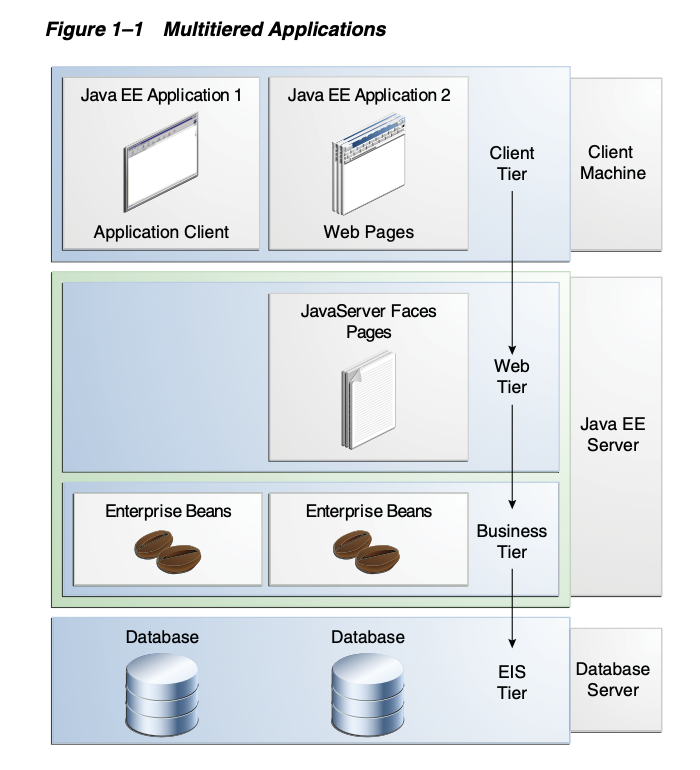
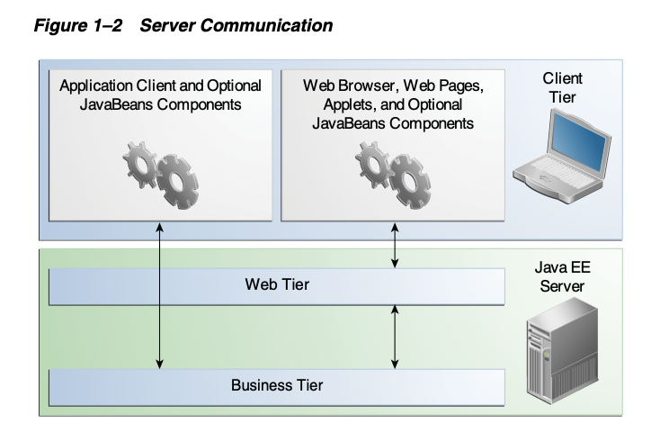
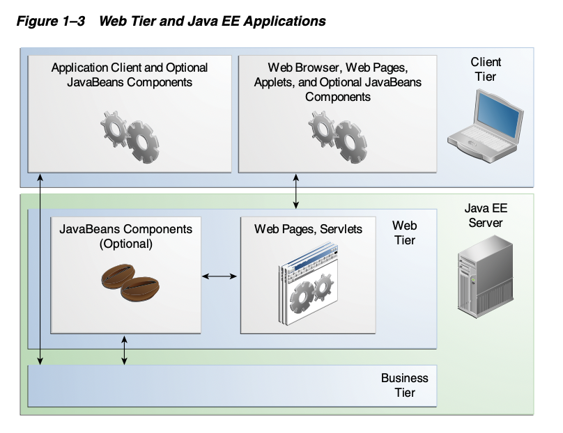
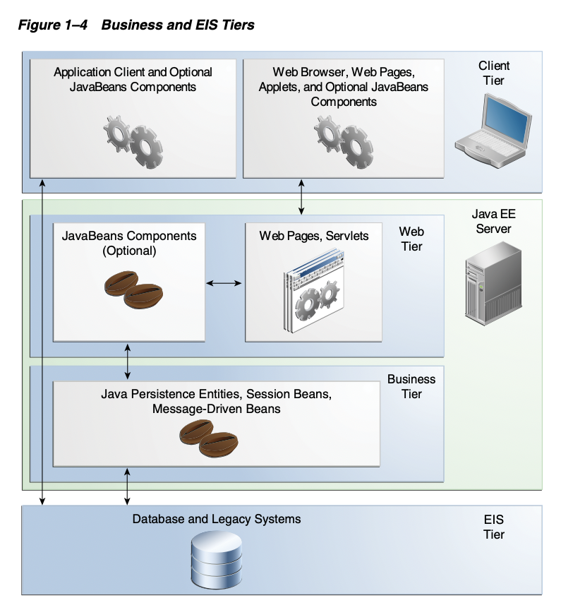
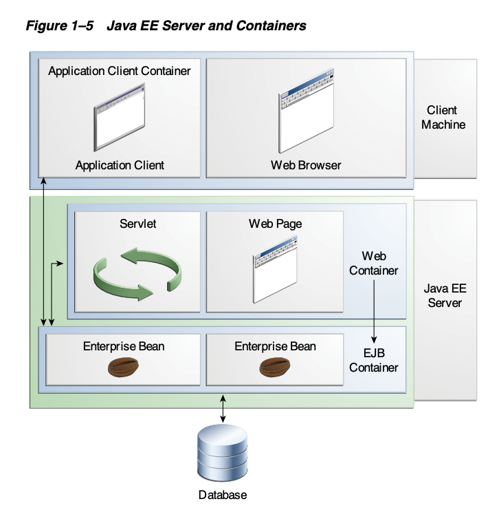
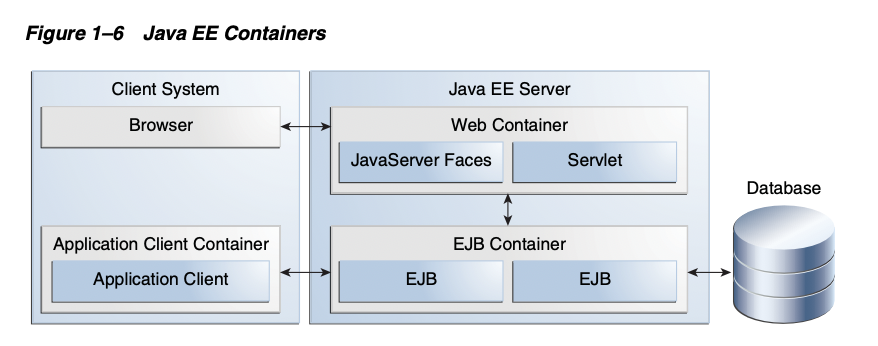
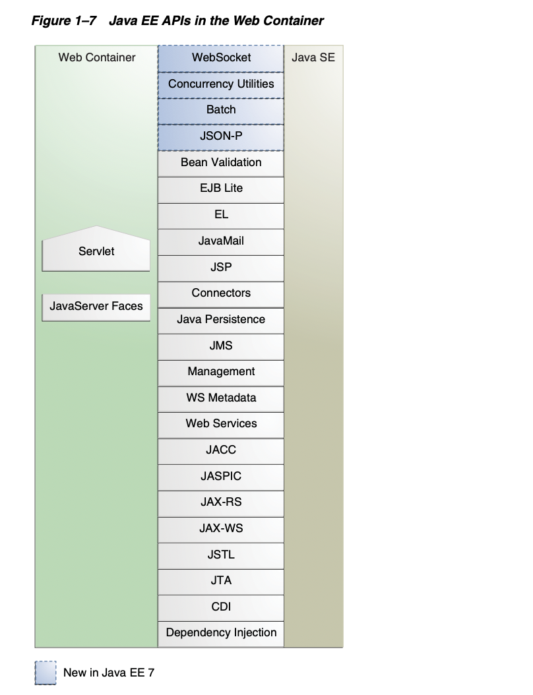
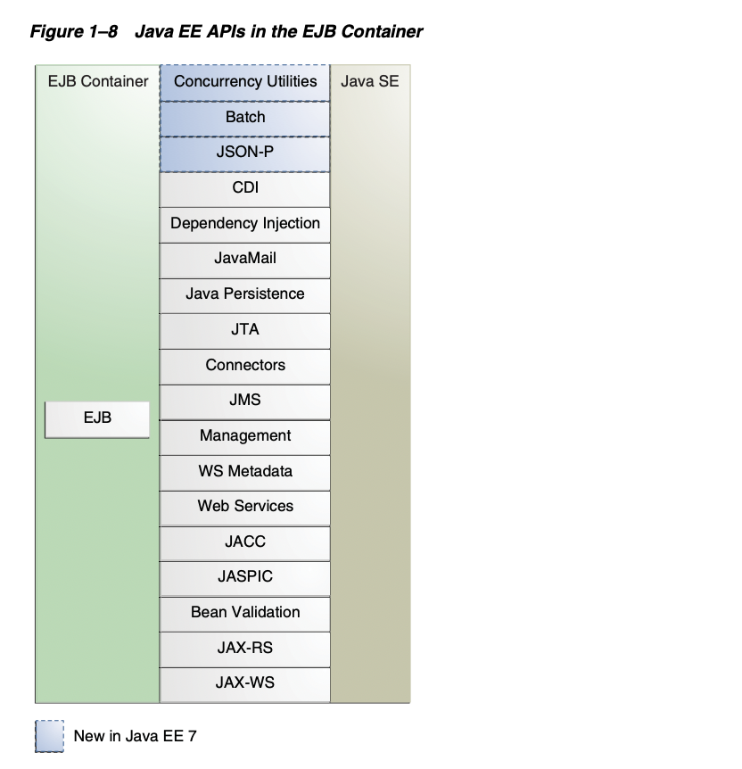
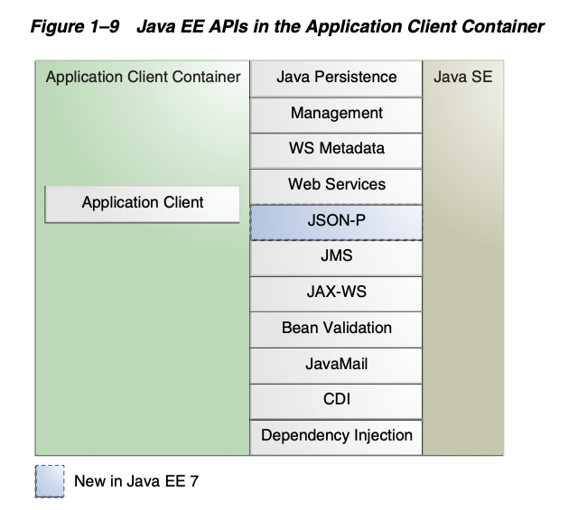
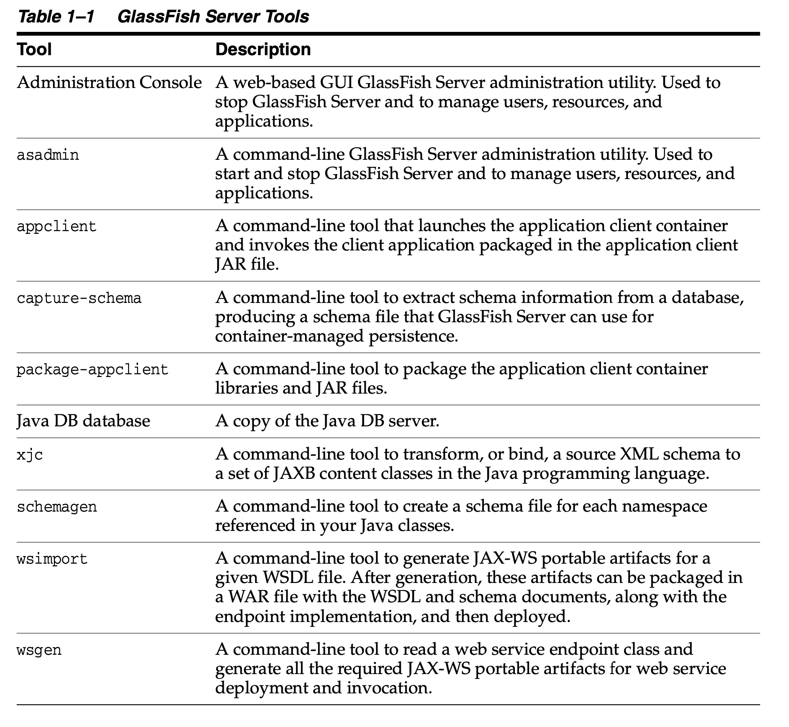

# M201 - Plataforma Java, edición empresarial (Java EE)

Por [Alan Badillo Salas](mailto:alan@nomadacode.com)

## Contenido

    - Comprendiendo Java EE
    - Características destacadas de Java EE
    - Modelo de la Aplicación en Java EE
    - Aplicaciones Distribuidas Multi-nivel
    - Contenedores Java EE
    - Soporte a Web Services
    - Ensamble y Desarrollo de Aplicaciones en Java EE
    - APIs de Java EE
    - Más APIs de Java EE 7/8
    - Herramientas para GlassFish Server

---

## Comprendiendo Java EE

Java Platform, Enterprise Edition (JEE) tiene el objetivo de facilitar el desarrollo mediante APIs, las cuales integran definiciones XML que pueden ser consumida en forma de anotaciones sobre el código.

> Una de las características más destacables es el uso de la Inyección de Dependencias (CDI), que puede ser aplicada a todos los componentes necesarios, ocultando de forma efectiva la creación y manejo de las instancias para facilitar su uso mediante la inyección a las referencias a través de anotaciones.

## Características destacadas de Java EE

El objetivo más importante de JavaEE es simplificar las configuraciones XML a través de anotaciones y clases POJO (Plain-Old Java Object).

Algunas características incorporadas en Java EE 7 son:

* Nuevas :
    * Batch Applications
    * Utilidades de Concurrencia y Paralelismo
    * Java API para JSON Processing (JSON-P)
    * Java API para WebSocket
* Nuevas características para compones EJB
* Nuevas características para Servlets
* Nuevas características para  componentes JavaServer Faces components
* Nuevas características para Java Message Service (JMS)

## Modelo de la Aplicación en Java EE

El modelo de aplicaciones en Java EE está diseñado para ser confiable, escalable, accesible y administrable y requiere implementar los productos en una forma multinivel en dos etapas:

* La lógica de negocios y presentación generada por los desarrolladores
* El sistema de servicios estándar provisto por la plataforma Java EE.

Los desarrolladores pueden confiar en la plataforma para resolver problemas de sistemas de muchos niveles desarrollando un sistema multinivel o multicapas. 

## Aplicaciones Distribuidas Multi-nivel

La implementación de las aplicaciones se da en componentes en las diferentes capas o niveles como se muestra en la *Figura 1-1*:

Las capas o niveles se dividen en las siguientes:

* **Nivel Cliente (Client-tier)** - Ejecuta los componentes en la máquina del cliente, por ejemplo, el navegador web.
* **Nivel Web (Web-tier)** - Ejecuta los componentes en el servidor de Java EE.
* **Nivel de Negocio (Business-tier)** - Ejecuta los componentes en el servidor Java EE.
* **Sistema de Información Empresarial (Enterprise Information System / EIS-tier)** - Ejecuta software en el servidor EIS. 

Las aplicaciones Java EE están hechas de componentes, los cuales son unidades funcionales de software que ensamblan y relacionan clases y archivos entre componentes.

---

> **Seguridad**

A diferencia de otros modelos empresariales de aplicaciones que requieren definir medidas específicas de seguridad en cada aplicación; Java EE habilita un entorno de seguridad y restricciones que pueden ser definidas en tiempo de despliegue y no de desarrollo.

La plataforma de Java EE hace las aplicaciones portables a una amplia variedad de implementaciones de seguridad para blindar a los programadores de la implementación de complejas características de seguridad.

La plataforma de Java EE provee estándares de reglas de acceso declarativas que son definidas por el desarrollador e interpretadas cuándo la aplicación es desplegada en el servidor.

Java EE también provee mecanismos estándares para el inicio de sesión, evitando que los programadores implementen estos mecanismos. La misma aplicación funciona en múltiples entornos seguros sin tener que modificar el código fuente.

---

> **Componentes de Java EE**

Los componentes principales son:

* Las aplicaciones de clientes y applets son componentes que se ejecutan de lado del cliente.
* Los Java Servlet, JavaServer Faces (JSF) y las JavaServer Pages (JSP) son tecnologías de componentes web que se ejecutan de lado del servidor.
* Los componentes EJB (Enterprise Java Beans) son componentes de negocio que se ejecutan de lado del servidor.

La diferencia entre los componentes de Java EE a diferencia de las clases "estándares", es que estos son ensamblados y verificados para cumplir los estándares de la plataforma y estar bien formados cumpliendo la especificación de Java EE para poder ser integrados a la aplicación o desplegados en el servidor.

**Clientes de Java EE**

Los clientes de Java EE generalmente serán clientes web o de aplicación.

---

> **Clientes Web**

Consiste en dos partes:

* **Páginas web dinámicas** - Las cuales contienen varios tipo como XML y HTMl, generado por componentes web en la capa web (Web-tier).
* **Navegador web** - El cuál renderiza el contenido de las páginas recibido por el servidor.

A este se le suele denominar el *Cliente Ligero (Thin Client)* ya que no ejecuta consultas a las bases de datos ni reglas de negocio complejas.

---

> **Clientes de Aplicación**

Estos clientes suelen usar sus propias interfaces gráficas (GUI) adaptadas mediante Swing, AWT (Abstract Window Toolkit) o la terminal (CLI - Command Line Interface). Aunque también podrían ser clientes que usen los servicios de Java EE directamente mediante la comunicación HTTP para proveer clientes basados en aplicaciones No-Java.

---

> **Applets**

Son programas instalables en una máquina virtual embebida en el navegador, para ejecutar una aplicación autocontenida. Sin embargo, esto se encuentra en desuso y es preferible un cliente web, para evitar romper las medidas de seguridad y tener que instalar plugins sobre el navegador del cliente.

---

> **Arquitectura de los componentes JavaBean**

Los componentes de JavaBeans permiten administrar el flujo de datos entre los siguientes:

* Componentes de aplicación ejecutándose en el servidor de Java EE
* Componentes de servicios y bases de datos

Los componentes JavaBeans no considerados como componentes de Java EE en la especificación.

Los componentes Java Beans son básicamente componentes que poseen métodos `get` y `set` retenidos, para orquestar una arquitectura simple y dirigida, aunque algunas veces requeriran de convenciones en el nombrado.

---

> **Comunicaciones en el Sevidor Java EE**

La comunicación en a nivel cliente (Client-tier) se hace mediante el consumo de los componentes de lógica de negocio (Business-tier)  o de forma indirecta a través de los componentes web (Web-tier), como se observa en la *Figura 1-2*.

También se pueden implementar opcionalmente JavaBeans intermedios entre los niveles web y de negocio como se muestra en la *Figura 1-3*.

---

> **Componentes de Negocio**

El código relacionado al negocio generalmente es dispuesto en beans empresariales (EJB - Enterprise JavaBeans), los cuales resuelven generalmente las piezas del negocio tales como transacciones bancarias, de inventarios o financieros y contables.

En la *Figura 1-4* se muestra cómo los beans son usados para recibir la información de los clientes y dirigir los resultados al almacenamiento, y de forma inversa, recuperar del almacenamiento datos del negocio, procesarlos y devolverlos a los clientes.

---

> **Nivel Enterprise Information System (EIS)**

La capa del sistema de información empresarial maneja el software EIS e incluye la infraestructura para sistemas empresariales, tales como el planificador de recursos empresariales (ERP - Enterprise Resource Planning), el procesador de transacciones primario, sistemas de bases de datos, y otros sistemas legados de información. Por ejemplo, los componentes de aplicaciones de Java EE podrían requerir información de conectividad del sistema de base de datos.

## Contenedores Java EE

Normalmente, las aplicaciones multinivel para clientes ligeros son difíciles de escribir ya que estas involucran líneas de intrincado código que maneja las transacciones y administración del estado, multihilos, piscinas de recursos y otros detalles complejos de bajo nivel.

La arquitectura de Java EE basada en componentes e independiente de la plataforma hace que las aplicaciones sean fáciles de escribir porque la lógica de negocio es organizada dentro de componentes reusables.

Aunado a esto, el servidor de Java EE provee servicios subyacentes in la forma de un contenedor para cada tipo de componente. Por lo que no se tendrán que desarrollar estos servicio y se podrá enfocar ese esfuerzo en la lógica de negocio.

---

> **Servicios de Contenedores**

Los contenedores son la interfaz entre el componente y la plataforma específica de bajo nivel que soporta al componente.

Antes que pueda ser ejecutado un servicio web, un bean empresarial o un componente de un cliente de aplicación, se deben ensamblar dentro de un módulo de Java EE y desplegar dentro de su contenedor.

El proceso de ensamblado involucra ajustes específicos del contenedor para cada componente en la aplicación de Java EE y para la aplicación de Java EE en sí misma.

Los ajustes del contenedor pueden personalizar el soporte interno provisto por el servidor de Java EE, incluyendo servicios como el de seguridad, administración de transacciones, la Interfaz del Directorio de Nombrado de Java (JNDI - Java Naming and Directory Interface) y la conectividad remota.

Aquí hay algunas características destacadas:

* **El modelo de seguridad de Java EE** - Permite configurar un componente web o un bean empresarial para restringir el acceso al sistema de recursos sólo a usuarios autorizados.
* **El modelo transaccional de Java EE** - Permite especificar las relaciones entre los métodos que hacen una simple transacción y así disponer todos los métodos en una transacción que es tratada como una unidad aislada.
* **Los servicios de descubrimiento JDNI** - Proveen una interfaz unificada para múltiples servicios de nombrado y directorios, así los componentes de aplicaciones pueden acceder a estos servicios.
* **El modelo de conectividad remota de Java EE** - Administra las comunicaciones a bajo nivel entre clientes y beans empresariales. Después que un bean empresarial es creado, un cliente invoca el método de lado del cliente, cómo si se ejecutara en la misma máquina virtual que la del servidor, transportando las entradas y salidas de forma transparente. 

Debido a que la arquitectura de Java Eee provee servicios configurables, los componentes contenidos dentro de la misma aplicación podrían comportarse distinto donde han sido desplegados. Por ejemplo, un bean empresarial podría tener ajustes de seguridad que le permitan cierto nivel de acceso en la base de datos en un entorno productivo a otro nivel de acceso a la base de datos en otro entorno productivo.

El contendor también administra los servicios no-configurables, tales como beans empresariales y ciclos de vida de los Serverlet, la piscina de recursos de las conexiones a la base de datos, la persitencia de datos y el acceso a las APIs de la plataforma de Java EE.

---

> **Tipos de Contenedores**

El proceso de despliege instala los componentes de la aplicación de Java EE en el contenedor de Java EE, como se muestra en la *Figura 1-5*.

Los servidores y contenedores son:

* **Servidor Java EE** - Ejecuta la porción de un produto Java EE. El servidor de Java EE provee los contenedores de EJB y Web.
* **Contenedor EJB** - Administra la ejecución de los beans empresariales para las aplicaciones de Java EE. Los beans empresariales y su contenedor se ejecuta en el servidor de Java EE.
* **Contenedor Web** - Administra la ejecución de páginas web, servlets y algunos componentes EJB para las aplicaciones de Java EE. Los componentes web y su contenedor se ejecuta en el servidor de Java EE.
* **Contenedor de la Aplicación de Cliente** - Administra la ejecución de los componentes de la aplicación del cliente. Los clientes de aplicaciones y su contenedor se ejecuta del lado del cliente.
* **Contendor Applet** - Administra la ejecución de applets. Consiste en un navegador web y una extensión de Java para el navegador y se ejecutan juntos del lado del cliente.

La *Figura 1-6* muestra las relaciones entre los contenedores de Java EE.

## Soporte a Web Services

Los Servicios Web son aplicaciones web empresariales de uso abierto, basado en estándares XML y protocoles de transporte que intercambian datos hacia las llamadas de clientes. La plataforma de Java EE provee las APIs XML y herramientas para rápidamente diseñar, desarrollar, probar y desplegar servicios web e interoperar completamente con clientes ejecutándose en plataformas que sean o no de Java.

Para escribir servicios y clientes con las APIs XML de Java EE, necesitamos pasar parámetros de datos hacia los métodos y procesar los datos devueltos; para servicios web orientados en documentos, deberemos mandar documentos que contengan los servicios de datos recibidos y enviados.

Una programación que no es de bajo nivel es necesaria por las implementaciones del API XML trabajan traduciendo los datos de la aplicacion en un flujo de datos basado en XML, los cuales son enviados en protocolos de transporte estandarizados en base XML.

---

> **XML**

El Lenguaje de Marcado Extensible (XML - Extensible Markup Language), es multiplataforma, extensible, basado en texto y estandarizado para la representación de datos.

Se pueden personalizar las etiquetas que representan los datos, para crear esquemas que especifiquen el uso adecuado que se le debería dar al documento XML y usar las hojas de estilo XML para administrar como se muestra y controlan los datos.

Por ejemplo, un servicio web podría usar XML y un esquema para producir una lista de precios, y la compañia que reciba la lista de precios, podría tener sus propias hojas de estilos para representar los datos según sus necesidades.

Algunos otros ejemplos son:

* Una compañia podría usar la información del precio del XML a través de un programa que traduzca el XML en HTML y así publicar la lista de precios en su propia intranet.
* Una compañía asociada podría usar la información del precio del XML a través de una herramienta para crear una presentación de marketing.
* Otra compañía podría leer el XML con la información del precio en una aplicación que la procese.

---

> **SOAP Transport Protocol**

Las peticiones y respuestas al servicio web son transmitidas como mensajes del Protocolo de Acceso de Objetos Simples (SOAP - Simple Object Access Protocol), a través de HTTP para habilitar el intercambio completo e interoperable entre los clientes y el servicio web, todo ejecutándose en diferentes plataformas y ubicaciones de internet. HTTP es un estándar de **petición-respuesta** para enviar mensajes a través de internet, y SOAP es un protocolo basado en XML que sigue el modelo **petición-respuesta**.

La porción de los mensajes transportados es como sigue:

* Define un mensaje basado en XML, describe que hay en el mensaje y explica como procesar el mensaje.
* Incluye las reglas de codificación para expresar instancias de los datos definidos y los tipos de datos contenidos en el mensaje.
* Define una convención basada en XML para representar la petición de un servicio remoto y el resultado de la respuesta.

---

> **Formato Estandarizado WSDL**

El Lenguaje Descriptivo de Servicios Web (WSDL - Web Services Description Language), es un formato estandarizado que describe servicios de red. La descripción incluye el nombre del servicio, la ubicación del servicio, y las formas de comunicarse con el servicio.

Las descripciones del servicio WSDL pueden ser publicadas en la web. El servidor de GlassFish provee una herramienta para generar las especificaciones del WSDL de un servicio web que usa llamadas a procedimientos remotodo para comunicarse con los clientes.

## Ensamble y Desarrollo de Aplicaciones en Java EE

Una aplicación de Java EE es empaquetada dentro de una o más unidades estándares para el despliegue de cualquier sistema basado en la plataforma Java EE. 

Cada unidad contiene:

* Uno o varios componentes funcionales, tales como beans empresariales, páginas web, servlets o applets.
* Un descriptor opcional de despliegue que describe su contenido. Una vez que la unidad de Java EE ha sido producida, se encuentra lista para ser desplegada.

El despliegue comunmente involucra el uso de herramientas de plataformas de despliegue para especificar la información específica de su ubicación, tal como una lista de usuarios locales que podrían tener acceso y el nombre de la base de datos local. Una vez desplegado en una plataforma local, la aplicación está lista para ejecutarse.

## APIs de Java EE

La *Figura 1-7* muestra las APIs disponibles en el Contenedor Web.

La *Figura 1-8* muestra las APIs disponibles en el Contenedor de Beans (EJB).

La *Figura 1-9* muestra las APIs disponibles en el Contenedor de Aplicaciones de Cliente.

---

> **Enterprise Java Beans**

Un componente de Enterprise JavaBeans (EJB), o bean empresarial, es un cuerpo de código que tiene campos y métodos para implementar módulos de la lógica de negocio. Podemos pensar los beans empresariales como los que ejecutan la lógica del negocio del lado del servidor.

Los beans empresariales pueden ser beans de sesión (session beans) o beans manejadores de mensajes (message-driver beans).

* Un **session bean** representa una conversación trascendente con el cliente. Cuando un cliente finaliza la ejecución, la el ben de sesión y sus datos también lo hacen.
* Un **message-driver bean** combina características de un bean de sesión y un suscriptor de mensajes, permitiendo a los componentes de negocio recibir mensajes asíncronamente. Comunmente, estos son mensajes del servicio de java (JMS - Java Message Service).

In la plataforma de Java EE 7/8 se incluyen nuevas características:

* Beans de sesiones locales asínconas en EJB Lite.
* Temporizadores no-persistentes en EJB Lite.

> La plataforma de Java EE 7 requiere *Enterprise Java Beans 3.2* y *Interceptors 1.2*
>
> La especificación de *Interceptors* es parte de la especificación de EJB.

---

> **Java Servlet**

La tecnología de Java Servlet permite definir clases tipo servlet específicadas sobre HTTP. Una clase Servlet extiende las capacidades de los servidores que alojan aplicaciones web bajo el modelo de programación *petición-respuesta*. Aunque los servlets pueden responder cualquier tipo de petición, frecuentemente son usadas para extender aplicaciones que alojan servicios web.

En Java EE 7/8 se incluyen nuevas características para la tecnología de Java Servlet:

* Anti-bloqueo *I/O*.
* Actualización al protocolo HTTP.

> La plataforma de Java EE 7 requiere *Servlet 3.1*

---

> **JavaServer Faces (JSF)**

La tecnología de JavaServer Faces (JSF) es un *framework* de interfaces de usuario para construir aplicaciones web.

Los principales componentes en JavaServer Faces son:

* Un framework de componentes GUI.
* Un modelo flexible para renderizar componentes en diferentes tipos de HTML o diferentes lenguajes de marcado y tecnologías similares. Un objeto `Renderer` genera las etiquetas para renderizar el componente y convertir los datos almacenados en un objeto-modelo hacía tipos que puedan ser representados en la vista.
* Un `RenderKit` estándar para generar etiquetas *HTML 4*

Las siguientes características son soportados por los componentes GUI.

* Validación de entradas
* Manejo de eventos
* Convenciones de datos entre el objeto-modelo y los componentes
* Un administrador para la creación de objetos-modelo
* Configuración de la navegación entre páginas
* Un Lenguaje de Expresiones (EL - Expression Languaje) 

> Todas estas características están disponibles usando las APIs estándares de Java y archivos XML de configuración.

En Java EE 7 se incluyen nuevas características de los JavaServer Faces.

* Etiquetas con soporte a HTML5
* Faces Flows
* Una librería de recursos de contratos

> La plataforma de Java EE 7 requiere *JavaServer Faces 2.2* y *Expression Language 3.0*

---

> **JavaServer Pages (JSP)**

La tecnología de Java Server Pages (JSP) permite colocar fragmentos de código de servlets dentro de documentos basados en texto. 

Una página JSP es un doucmento de texto que contiene dos tipos de texto:

* **Datos estáticos** - Lo cuales pueden ser expresadas en cualquier formato de texto como HTML o XML
* **Elementos JSP** - Los cuales determinan como la página construye el contenido dinámico 

En [http://docs.oracle.com/javaee/5/tutorial/doc/](http://docs.oracle.com/javaee/5/tutorial/doc/) podemos consultar más información de JSP.

> La plataforma de Java EE 7 requiere *JavaServer Pages 2.3*, pero se recomienda el uso de *Facelets* para nuevas aplicaciones.

---

> **JavaServer Pages Stabdard Tag Library (JSTL)**

La librería estándar de etiquetas de JavaServer Pages (JSTL - JavaServer Pages Standard Tag Library) encapsula la funcionalidad central común de muchas aplicaciones de JSP. En lugar de mezclar etiquetas de múltiples proveedores, podemos usar una única librería estandarizada de etiquetas.

Esta estandarización permite desplegar aplicaciones en cualquier contenedor de JSP que soporte JSTL y hace que sea ás probable que la librería de etiquetas esté optimizada.

JSTL tiene etiquetas para la iteración y condicionales para el control de flujo, etiquetas para minupular documentos XML, etiquetas de globalización, etiquetas para acceder a bases de datos SQL y etiquetas par usar funciones comunes.

> La plataforma de Java EE 7 requiere *JSTL 1.2*

---

> **Java Persistence API (JPA)**

El API de Persistencia de Java (JPA - Java Persistence API) es una solución basada en estándares para la persistencia. La persistencia usa un mapeo objeto/relacional que se aproxima a un puente entre el modelo orientado a objetos y el modelo relación de una base de datos.

El API de Persistencia de Java también puede ser usada en aplicaciones de Java SE fuera del entorno de Java EE.

La persistencia consiste en la siguientes áreas:

* El Java Persistence API
* El lenguaje de consultas
* El mapeo de metadatos objeto/relacional

> La plataforma de Java EE 7 requiere *Java Persistence API 2.1*

---

> **Java Transaction API (JTA)**

El API de Transacciones de Java (JTA - Java Transaction API) provee una interfaz estándar para realizar transacciones. La arquitectura de Java EE provee un sistema por defecto de auto-commits para manejar las sumisiones (commits) y las restauraciones (rollbacks).

Un auto-commit significa que cualquier otra aplicación que este viendo los datos verá las actualizaciones después de que la base de datos lea o escriba operaciones. Sin embargo, si la aplicación ejecuta dos operaciones de acceso a la base de datos que dependan una de la otra, veremos buscaríamos usar el API de JTA para demarcar el inicio de la transación, las cancelaciones y envios.

> La plataforma de Java EE 7 requiere *Java Transaction API 1.2*

---

> **Java API for RESTful Web Services (JAX-RS)**

El Java API para Servicios Web RESTful (JAX-RS - Java API for RESTful Web Services) define APIs para el desarrollo de servicios web construidos acordes al estilo de arquitectura del Estado de Transferencia Representacional (REST - Representational State Transfer).

Una aplicación JAX-RS es una aplicación web que consiste en clases empaquetadas al igual que un servlet en un archivo WAR con sus librerías requeridas.

> La plataforma de Java EE 7 requiere *JAX-RS 2.0*

---

> **Managed Beans**

Los Beans Administados (Managed Beans) son objetos ligeros administrados por el contenedor (POJOs - Plain-Old Java Objects) con los mínimos requerimientos y soportan un pequeño conjunto de servicios básicos, tales como la inyección de recursos, callbacks para el ciclo de vida e interceptores.

Los Managed Beans representan una generalización de los los beans administrados especificados por los JavaServer Faces y pueden ser usados en cualquier aplicación de Java EE, no solo en módulos web.

> La plataforma de Java EE 7 requiere *Managed Beans 1.0*
>
> *La especificación de los Managed Beans es parte de la plataforma de Java EE bajo la especificación (JSR 342).*

The Managed Beans specification is part of the Java EE 7 platform specification (JSR 342). The Java EE 7 platform requires Managed Beans 1.0.

---

> **Context and Dependency Injection (CDI)**

Los Contextos y la Inyección de Dependencias para Java EE (CDI - Context and Dependency Injection) define un conjunto de servicios contextuales, provistos por los contenedores de Java EE, para facilitarle a los desarrolladores usar los beans empresariales a lo largo de JavaServer Faces en las aplicaciones web.

Está diseñado para usar objetos de estado completo (stateful objects). El CDI también tiene otras aplicaciones, permitiendo a los desarrolladores bajar el acoplamiento sin perder el tipado seguro.

> La plataforma de Java EE 7 requiere *CDI 1*

---

> **Dependency Injection**

La Inyección de Dependencias (Dependency Injection) para Java, define un conjunto de anotaciones estándares (y una interfaz) para usarse en las clases inyectables.

En la plataforma de JavaEE se provee el soporte a CDI para la inyección de dependencias. Especificamente podemos usar puntos de inyección solo en aplicaciones que tienen habilitado el CDI.

> La plataforma de Java EE 7 requiere *Dependency Injection 1.0*

---

> **Bean Validation**

La especificación para la Validación de Beans (Bean Validation)  define un modelo de metadatos y un API para validar los datos en los componentes de Java Beans. En lugar de distribuir las validadciones de los datos sobre muchas capas, tales como en el navegador y del lado del servidor, podemos definir las reglas de validación  en un solo lugar y compartirlo a tráves de diferentes capas.

> La plataforma de Java EE 7 requiere *Bean Validation 1*

> **Java Message Service API (JMS)**

El API de Servicio de Mensajería de Java (JMS - Java Message Service) es un estándar de mensajería que le permite a los componentes de aplicaciones de Java EE crear, enviar, recibir y leer mensajes. Esta habilita la comunicación distribuida de forma desacoplada, confiable y asíncrona.

En la plataforma de Java EE podemos encontrar nuevas características como:

* Una nueva y simplificada API que ofrece una alternativa simple respecto al API anterior. Esta API incluye el objeto `JSMContext` que combina las funcionalidades de `Connection` y `Session`.
* Todos los objetos implementan un método `close` de la interfaz `java.lang.Autocloseable` y así estos pueden ser usados en sentencias `try-with-resources` de Java SE 7.

> La plataforma de Java EE 7 requiere *Bean Validation 2.0*

---

> **Java EE Connector Architecture**

La Arquitectura de Conexión de Java EE (Connector Architecture) es usada por herramientas de terceros y sistemas integrados para crear adaptadores de recursos que soportan el acceso a los sistemas de información empresaria (EIS - Enterprise Information Systems) que pueden ser extendidos y agregados como plugins en un producto de Java EE.

Un adaptador de recursos es un componente de software que le permite a los componentes de una aplicación de Java EE acceder e interacturar con el administrador de recursos interno del EIS.

Como cada adaptador de recursos es específico para cada administrador de recursos, un adaptador de recursos tipicamente es diferente y existe uno para cada tipo de base de datos o sistema de información empresarial.

El Connector Architecture también prove un paradigma orientado al rendimiento (performance-oriented), seguridad, escalabilidad e integración transaccional basa de en mensajes de los servicios web basados en la plataforma de Java EE, con un EIS que puede ser spincrono o asíncrono.

Existen aplicaciones y EIS integrados a través de la arquitectura de conexión dentro de la plataforma Java EE, que puede ser expuesta como servicios web basados en XML usando componentes y modelos de JAX-WS y Java EE.

Es decir, JAX-WS y la Arquitectura de Conexión de Java EE son tecnologías complementarias para la integración de aplicaciones empresariales (EAI - Enterprise Application Integration), e integraciones de negocio **end-to-end**.

The Java EE Connector Architecture also provides a performance-oriented, secure, scalable, and message-based transactional integration of Java EE platform–based web services with existing EISs that can be either synchronous or asynchronous. Existing applications and EISs integrated through the Java EE Connector Architecture into the Java EE platform can be exposed as XML-based web services by using JAX-WS and Java EE component models. Thus JAX-WS and the Java EE Connector Architecture are complementary technologies for enterprise application integration (EAI) and end-to-end business integration.
The Java EE 7 platform requires Java EE Connector Architecture 1.7.

> La plataforma de Java EE 7 requiere *Java EE Connector Architecture 1.7*

---

> **Java Mail API**

Las aplicaciones de email para Java (Java Mail API) envian notificaciones de correo compuestas en dos partes:

* Una interfaz a nivel aplicación usuada por los componentes de aplicación para el envío de correo.
* Una interfaz de proveedor de servicios.

La plataforma de Java EE incluye el Java Mail API con un proveedor de servicio que permite a los componentes el envío de correos por internet.

> La plataforma de Java EE 7 requiere *Java Mail 1.5*

---

> **Java Authorization Contract for Containers (JACC)**

El Autorizador de Contratos para Contenedores (JACC - Java Authorization Contract for Containers) es una especificación que define un contrato entre el servidor de aplicaciones de Java EE y un proveedor de políticas de autorización.

Todos los contenedores de Java EE soportan estos contratos. La espeición de JACC define clases de `java.security.Permission` que satisfacen el modelo de autorización en Java EE.

La especificación define la contrucción de decisiones  de acceso al contenedor para operaciones y otorgale estas clases de permisos. Esta define la semántica que provee políticas que usan las clases para generar nuevos permisos incluyendo la definición y los roles.

> La plataforma de Java EE 7 requiere *JACC 1.5*

---

> **Java Authentication Service Provider Interface for Containers (JASPIC)**

La Interfaz del Proveedor del Servicio de Autenticación para Contenedores de Java (JASPIC - Java Authentication Service Provider Interface for Containers) en su especificación define una Interfaz de Provedor de Servicio (SPI - Service Provider Interface) la cual provee una impementación para el mecanismo de auttenticación de mensajes que puede ser integrado en el cliente o en el servidor, procesando mensajes en el contenedor o el entorno de ejecución.

El proveedor de autenticación se integra a través de esta interfaz operando mensajes de red hacia a los contenedores que hacen las llamadas. El proveedor de autenticación transforma los mensajes de salida y así las fuentes de cada mensaje pueden ser autenticadas por el contenedor receptor. y el recipiente de los mensajes puede ser autenticado por el emisor de mensajes. El proveedor de la autenticación autentica cada mensaje entrante y lo devuelve a los contenedores llamados para establecer un identificador que establece el resultado de los mensajes autenticados.

> La plataforma de Java EE 7 requiere *JASPIC 1*

---

> **Java API for WebSocket**

El WebSocket es un protocolo de aplicación que provee una comunicación dual (full-duplex) entre dos nodos sobre TCP. El API de Java para WebSocket en las aplicaciones de Java EE habilita la creacipon de puntos destinatarios usando anotaciones que especifican parámetros de comunicación haciá los puntos finales y designa el ciclo de vida de los métodos callbacks.

> La plataforma de Java EE 7 requiere *WebSocket 1.0*
>
> *Esta es una nueva característica incorporada desde Java EE 7*.

---

> **Java API for JSON Processing* (JSON-P)**

JSON es un formato de intercambio de datos basado en texto que deriva de JavaScript y es usado en servicios web y otras aplicaciones conectadas. El API de Java para el Procesamiento de JSON (JSON-P - Javascript Object Notation Processing), habilita a las aplicaciones para decodificar, transformar y consultar datos JSON usuando el modelo de objetos (object-model) o el modelo de flujos (Streaming Model).

> La plataforma de Java EE 7 requiere *JSON-P 1.0*
>
> *Esta es una nueva característica incorporada desde Java EE 7*.

---

> **Concurrency Utilities for Java EE**

Las Utilidades de Concurrencia para Jave EE (Concurrency Utilities for Java EE) son un API estándar para proveer capacidades asíncronas a los componentes de la aplicación de Java EE a través de los siguientes tipos de objetos:

* Managed Executor Service
* Managed Scheduled Executor Service
* Managed Thread Factory
* Context Service

> La plataforma de Java EE 7 requiere *Concurrency Utilities for Java EE 1.0*
>
> *Esta es una nueva característica incorporada desde Java EE 7*.

---

> **Batch Applications for the Java Platform**

Las Aplicaciones Batch para la plataforma de Java, son teras que puden ser ejecutadas sin interacción del usuario. Las aplicaciones batch en su especificación es que son un framework que provee soporte para crear y ejecutar trabajos en lotes, y la especificación de la tarea está basada en XML y el API de Java implementa los Batch Artifacts.

> La plataforma de Java EE 7 requiere *Batch Applications for Java EE 1.0*
>
> *Esta es una nueva característica incorporada desde Java EE 7*.

## Más APIs de Java EE 7/8

Java EE 7/8 requiere muchas de las APIs que están disponibles en la plataforma estándar de Java (Java SE - Standard Edition) y estas están incluidas del mismo modo en Java EE.

> **Java Database Connectivity API (JDBC)**

El API de Conectividad a Bases de Datos de Java (JDBC - Java Database Connectivity) permite invocar comandos SQL desde los métodos usando el lenguaje de programación de Java. Podemos usar el API de JDBC en un bean empresarial cuando tengamos bean de sesión con acceso a la base de datos. También podemos usar el API de JDBC desde un servlet o una página JSP para acceder a la base de datos directamente sin pasar por un bean empresarial.

El API de JDBC consiste en dos partes:

* Una interfaz a nivel de aplicación usada por los componentes de la aplicación para acceder a la base de datos
* Una interfaz que provee el servicio para enlazar el Driver de JDBC a la plataforma de Java EE.

> La plataforma de Java EE 7 requiere *JDBC 4.1*

---

> **Java Naming and Directory Interface API (JNDI)**

El API de Interfaz de Nombrado y Directorio de Java (JNDI - Java Naming and Directory Interface) provee funcionalidades de nombrado y directorio, permitiendo a las aplicaciones acceder a múltiples servicios de nombrado y directorio, como LDAP (Lightweight Directory Access Protocol), DNS (Domain Name System) y NIS (Network and Information Systems).

El API de JNDI provee aplicaciones con métodos que realizan operaciones estándares con directorios, tales como asociar atributos con objetos y buscar objetos usando sus atributos. Al usar JNDI, la aplicación de Java EE puede almacenar y recuperar cualquier tipo de objeto nombrado de Java, permitiendo asi que la aplicación coexista con muchos legados de sistemas y aplicaciones.

El Servicio de Nombrado de Java EE provee a clientes de aplicaciones, beans empresariales, componentes web acceder a un entorno de nombrado de JNDI. Un entorno de nombrado le permite a los componentes personalizarse sin la necesidad de acceder o cambiar componentes en el código fuente. Un contenedor implementa el entorno de los componentes y provee un contexto de nombrado de JNDI.

Los entornos de nombrado proveen cuatro nombres de espacios lógicos:  `java:comp`, `java:module`, `java:app`, y `java:global` para objetos disponibles hacia componentes, módulos o aplicaciones; o ser compartidos por todas las aplicaciones desplegadas. Un componente de Java EE puede acceder al sistema provisto de nombrado y a objetos definidos por el usuario. 

Los nombres de algunos objetos del sistema provisto, tales como el objeto `DataSource` por defecto en JDBC, el objeto por defecto `connection factory` de JMS, y el objeto `UserTransaction` de JTA, son almacenados en el espacio de nombres `java:comp`. La plataforma de Java EE permite a un componente nombrar objetos definidos por el usuario, tales como los beans empresariales, los entornos de registros, los objetos JDBC DataSource, y los destinatarios de mensajes.

Un componente de Java EE puede también ubicar su contexto en el entorno de nombrado usando las interfaces de JNDI. Un componente puede crear un objeto de `javax.naming.InitialContext` para byscar sobre el contexto del entorno de nombrado en el `InitialContext` bajo el nombre `java:comp/env`. Los componentes del entorno de nombrado son almacenados directamente en el contexto del entorno de nombrado o en cualquier de los subcontextos directos o indirectos.

---

> **JavaBeans Activation Framework**

El Framework de Activación de JavaBeans (JAF - JavaBeans Activation Framework) es usado por el API de JavaMail. JAF provee servicios estándares para determinar el tipo de una pieza arbitraria de datos, encapsulando su acceso y descubriendo las operaciones disponibles en ella, para crear un componente apropiado de JavaBeans que ejecute estas operaciones.

---

> **JavaAPIforXMLProcessing (JAXP)**

El API para Procesamiento de XML de Java (JAXP - Java API for XML Processing) es parte de la plataforma estándar de Java SE, que soporta el procesamiento de documentos XML usando el Objeto de Modelado de Documentos (DOM - Document Object Model), el API Simple de XML (SAX - Simple API XML), y el Lenguaje Extensible de Transformación de Hojas de Estilo (XSLT - Extensible Stylesheet Language Transformations).

JAXP le permite a las aplicaciones reconstruir y transformar documentos XML independientemente de la implementación particular del procesador de XML (`XML-processing`).

JAXP también brinda soporte a nombres de espacios, los cuales nos permitirán trabajar con esquemas que podrían tener conflictos de nombrado. JAXP está diseñado para ser flexible, permitiéndonos usar cualquier reconstructor de `XML-compliant` o `XSL processor` desde la aplicación y soportar el esquema definido por el W3C (Worldwide Web Consortium).

> Podemos encontrar lla información del esquema de W3C en [http://www.w3.org/XML/Schema](http://www.w3.org/XML/Schema).

---

> **Java Architecture for XML Binding (JAXB)**

La Arquitectura para el Enlazado XML (JAXB - Java Architecture for XML Binding) provee una forma conveniente de enlazar un esquema XML a su representación en programas del lenguaje Java. 

JAXB puede ser usado de forma independiente o combinada con JAX-WS, el cual provee un enlace de datos estándar para los mensajes del servicio web.

Todos los contenedores de aplicaciones de cliente de Java EE y los contenedores de EJB soportan el API de JAXB.

> La plataforma de Java EE 7 requiere *JAXB 2.2*

---

> **Java API for XML Web Services (JAX-WS)**

El API de Java para Servicios Web XML (JAX-WS - Java API for XML Web Services) provee una especificación para el soporte de servicios web que usen el API de JAXB para enlazar datos XML hacia objetos de Java.

La especificación de JAX-WS define APIs de cliente para acceder a los servicios web como también a técnicas para la implementación de las rutas finales (endpoints) de los servicios web.

La especificación sobre la Implementación de Servicios Web Empresariales (Implementing Enterprise Web Services) describe los servicios y clientes desplegados en JAX-WS. Las especificaciones de EJB (Enterprise JavaBean) y de Java Servlet también describen aspectos tales como el despliegue. Las aplicaciones basadas en JAX-WS pueden ser desplegadas usando estos modelos de despliegue.

La especificación de JAX-WS describe también el soporte para manejadores de mensajes que pueden procesar los mensajes de las peticiones y respuestas. En general, estos manejadores de mensajes se ejecutan en el mismo contenedor y con los mismos privilegios y contexto de ejecución como el cliente JAX-WS o el componente de ruta final (endpoint) con el cual está asociado. Estos manejadores de mensajes tienen acceso al mismo espacio de nombres JDNI que su componente asociado. Si hay serializadores y deserializadores personalizados, estos serán tratados de la misma forma que los manejadores de mensajes.

These message handlers have access to the same JNDI namespace as their associated component. Custom serializers and deserializers, if supported, are treated in the same way as message handlers.

> La plataforma de Java EE 7 requiere *JAX-WS 2.2*

---

> **SOAP with Attachments API for Java (SAAJ)**

El API de Java para SOAP con Adjuntos (SAAJ - SOAP with Attachments API for Java) es una API de bajo nivel de la cual depende JAX-WS. SAAJ permite la producción y consumo de SOAP (Simple Object Access Protocol) con notas adjuntas.

La mayoría de los desarrolladores no usan el API de SAAJ, en lugar de ello usan el API de alto nivel JAX-WS.

> **Java Authentication and Authorization Service (JAAS)**

El Servicio de Java para Autenticación y Autorización (JAAS - Java Authentication and Authorization Service) provee un medio para que las aplicaciones de Java EE autentiquen y autoricen usuarios específicos o grupos de usuarios que lo ejecutan.

JAAS es una versión del lenguaje de programación Java del framework estándar PAM (Pluggable Authentication Module), el cual extiende la plataforma de arquitectura de seguridad de Java  para soportar autorizaciones basadas en usuarios.

---

> **Common Annotations for the Java Platform**

Las Anotaciones permiten crear un estilo de programación declarativa en la plataforma de Java.

> La plataforma de Java EE 7 requiere *Common Annotations for the Java Platform 1.2*

## Herramientas para GlassFish Server

El Servidor de GlassFish (GlassFish Server) es una implementación completa de la plataforma Java EE 7/8.

En adición al soporte de todas las APIs, el servidor incluye un conjunto de herramientas para Java EE que no son parte de la plataforma de Java EE 7/8, pero que son provistas a conveniencia del desarrollador.

El servidor de GlassFish contiene las herramientas listadas en la *Tabla 1-1*.

             