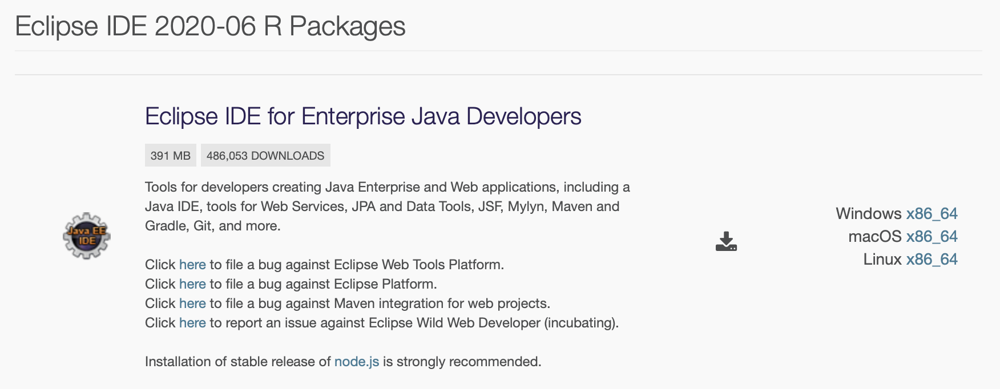
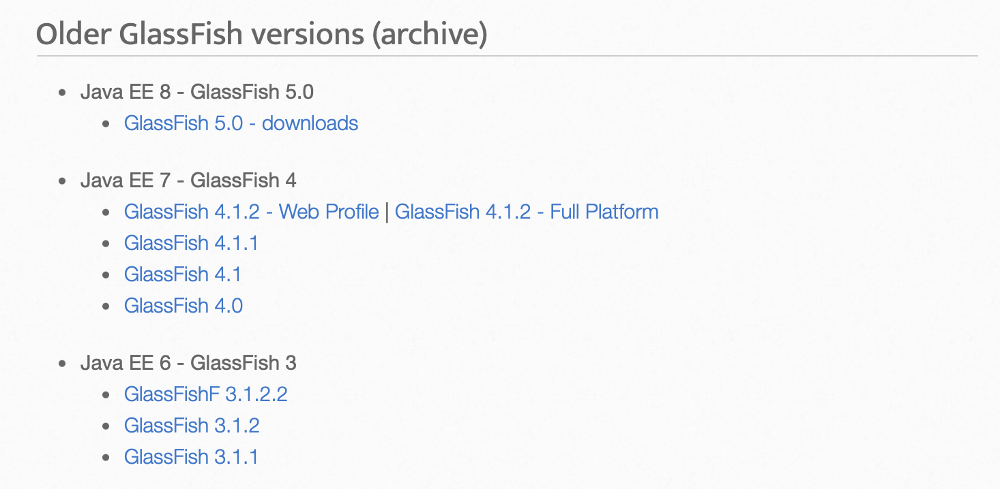
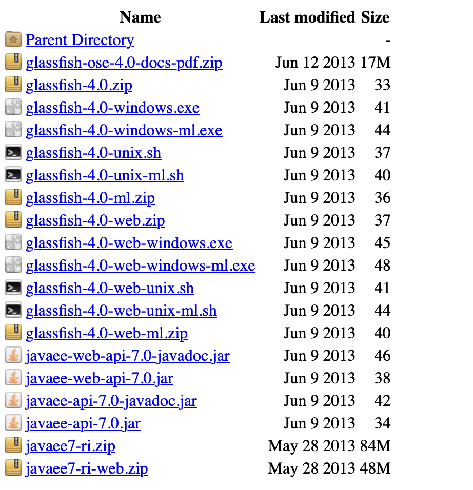

# M202 - Aplicaciones y herramientas de desarrollo empresarial

Por [Alan Badillo Salas](mailto:alan@nomadacode.com)

## Contenido

    - Instalación e inicio de GlassFish Server
    - Escribir una aplicación web de prueba simple

---

## Instalación de Eclipse

[https://www.eclipse.org/downloads/packages/release](https://www.eclipse.org/downloads/packages/release)

## Instalación e inicio de GlassFish Server

[https://javaee.github.io/glassfish/download](https://javaee.github.io/glassfish/download)

[https://download.oracle.com/glassfish/4.0/release/index.html](https://download.oracle.com/glassfish/4.0/release/index.html)

## Escribir una aplicación web de prueba simple

