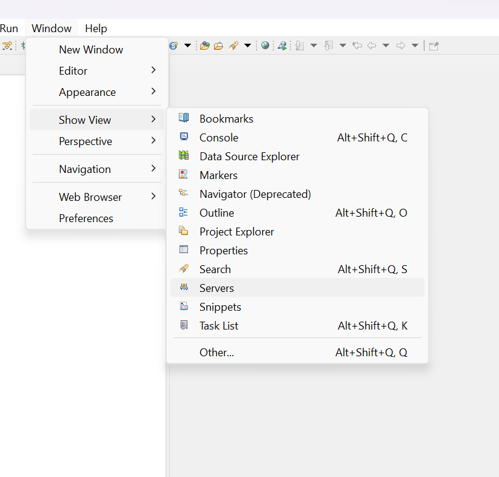

# M202 - Aplicaciones y herramientas de desarrollo empresarial

Por [Alan Badillo Salas](mailto:alan@nomadacode.com)

## Contenido

    - Instalación e inicio de GlassFish Server
    - Escribir una aplicación web de prueba simple

---

## Instalación de Java JDK 1.8

[https://www.oracle.com/java/technologies/javase/javase8-archive-downloads.html](https://www.oracle.com/java/technologies/javase/javase8-archive-downloads.html)

## Instalación de Eclipse

[https://www.eclipse.org/downloads/packages/release](https://www.eclipse.org/downloads/packages/release)

## Instalación e inicio de GlassFish Server

[https://javaee.github.io/glassfish/download](https://javaee.github.io/glassfish/download)

[https://download.oracle.com/glassfish/4.0/release/index.html](https://download.oracle.com/glassfish/4.0/release/index.html)

## Escribir una aplicación web de prueba simple

> **Paso 1:** Creamos un nuevo proyecto de maven

> **Paso 2:** Seleccionamos la ubicación del proyecto si no es en el espacio de trabajo por defecto

> **Paso 3:** Buscamos el arquetipo de proyecto `maven-archetype-webapp` y seleccionamos el de `com.apache.maven.archetypes`

> **Paso 4:** Configuramos el *Group Id* con el nombre de nuestra organización (generalmente un dominio web único que está asociado a nuestra empresa, pro ejemplo, `com.miempresa`) y el *Artifact Id* que es el nombre del proyecto

> **Paso 5:** Exploramos la estructura del proyecto

> **Paso 6:** Abrimos las propiedades del proyecto

> **Paso 7:** Cambiamos la versión del compilador de Java

> **Paso 8:** Hacemos que coincida el JRE con el JDK, seleccionando `Installed JREs`

> **Paso 9:** Agregamos la instalación del JDK 1.8

> **Paso 10:** Seleccionamos el tipo *Standard VM*

> **Paso 11:** Buscamos la carpeta de instalación del JDK 1.8

> **Paso 12:** Seleccionamos la carpeta raíz (no selecciones por error alguna subcarpeta)

> **Paso 13:** Validamos que la instalación sea correcta

> **Paso 14:** Activamos la versión del JDK 1.8

> **Paso 15:** 

> **Paso 16:** Editamos la versión del JRE a Java SE 1.8 en el Java Build Path

> **Paso 17:** Seleccionamos Java SE 1.8

> **Paso 18:** Descargamos los GlassFish Tools desde el archivo de eclipse
>
> `[Proyectos Archivados de Eclipse]`
> [https://www.eclipse.org/projects/archives.php](https://www.eclipse.org/projects/archives.php)
> 
> `GlassFish Tools Repository`
> [http://archive.eclipse.org/archived_projects/glassfish-tools.tgz](http://archive.eclipse.org/archived_projects/glassfish-tools.tgz)
>
> Descomprimimos `glassfish-tools.tgz`
>
> Seleccionamos en instalar nuevo software

> **Paso 19:** Agregamos el repositorio local descargado `...\glassfish-tools\downloads\1.0.1\repository`

> **Paso 20:** Buscamos la carpeta de *GlassFish Tools v1.0.1* del archivo descomprimido, por ejemplo, `glassfish-tools/downloads/1.0.1/repository`

> **Paso 21:** Agregamos el repositorio local

> **Paso 22:** Seleccionamos solamente el plugin de *GlassFish Tools*

> **Paso 23:** Espera que termine de verificar

> **Paso 24:** Acepta las licencias

> **Paso 25:** Confirma la instalación de GlassFish Tools

> **Paso 26:** Acepta la advertencia de seguridad

> **Paso 27:** Reinicia eclipse

> **Paso 28:** Es posible que eclipse falle al abrir y se cierre inesperadamente
>
> En este caso abriremos una consola ubicada sobre la carpeta de Eclipse (la que contiene el ejecutable `eclipse.exe`) escribiendo `cmd` sobre la barra del directorio

> **Paso 29:** Ejecuta el comando `eclipse -clean`

> **Paso 30:** Observa los errores que impedian abrirlo

> **Paso 31:** Navega a la ventana de servidores

> **Paso 32:** Agrega un nuevo servidor

> **Paso 33:** Selecciona un Servidor de GlassFish

> **Paso 34:** Configura la ubicación de GlassFish 4

> **Paso 35:** Selecciona la carpeta principal de GlassFish v4, sin seleccionar por error alguna subcarpeta

> **Paso 36:** Verifica que sea correcta la ubicación

> **Paso 37:** Configura las propiedades del servidor (dejar en los valores por defecto)

> **Paso 38:** Observa el nuevo servidor en la ventana de servidores

> **Paso 39:** Es posible que el proyecto tenga un problema de `org.eclipse.jst.j2ee.project.facet.IJ2EEFacetConstants`

> **Paso 40:** Agregar el software de Oxygen.2
>
> Nombre: `Eclipse Oxygen.2`
> Ubicación: `http://download.oracle.com/otn_software/oepe/library/eclipse-oxygen.2`
>
> Marca todas las casillas

<!-- [https://download.oracle.com/otn_software/oepe/12.2.1.8/oxygen/repository/dependencies/](https://download.oracle.com/otn_software/oepe/12.2.1.8/oxygen/repository/dependencies/)

 -->

