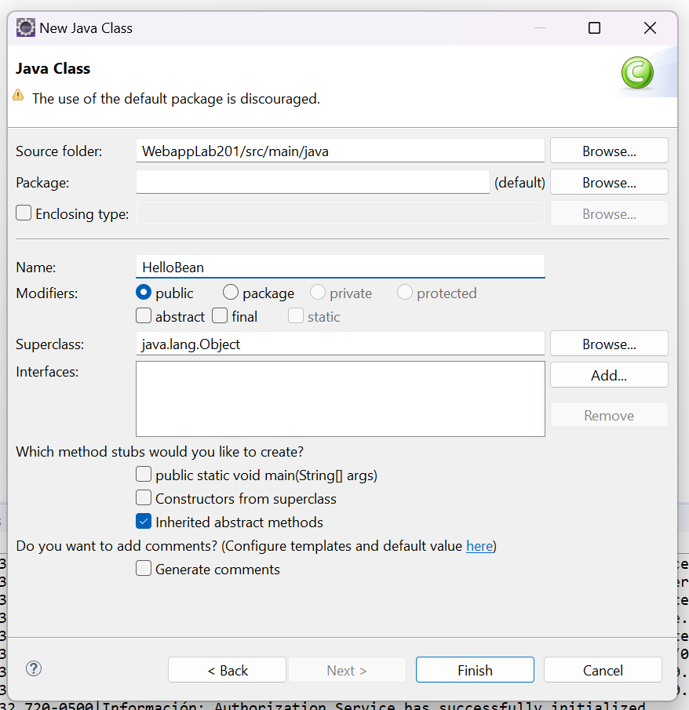
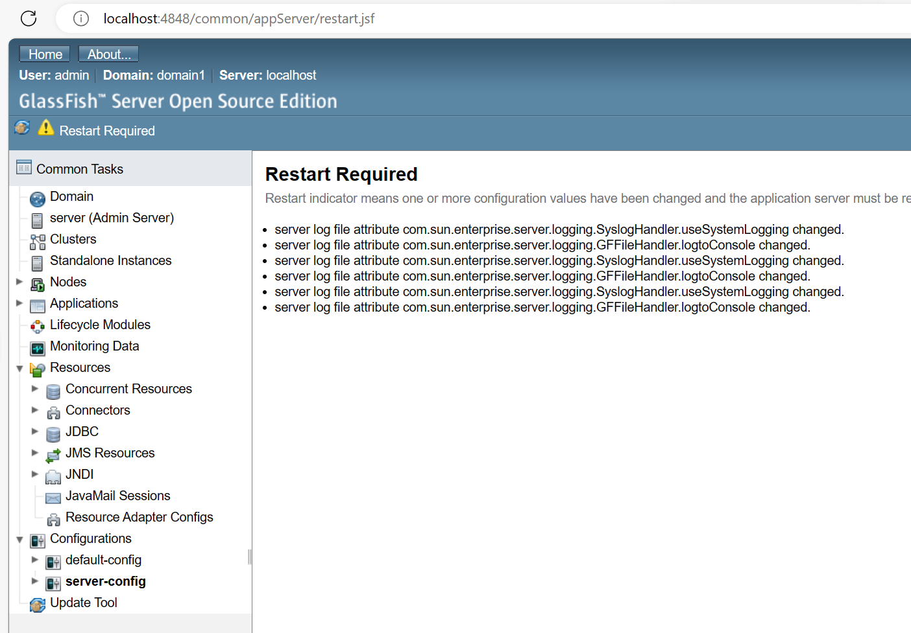

# M203 - JavaBeans, anotaciones y logs

Por [Alan Badillo Salas](mailto:alan@nomadacode.com)

## Contenido

    - Configuración del Proyecto
    - Comprendiendo JavaBeans y anotaciones
    - Adición de un logger a una aplicación

---

### Configuración del Proyecto

> **Paso 1** - Creamos un nuevo proyecto de Maven


> **Paso 2** - Elejimos el arqurtipo de `maven-archetype-webapp` de `org.apache.maven.archetypes`


> **Paso 3** - Configuramos el nombre y organización del proyecto


> **Paso 4** - Agregamos las librerías de Java EE al *Java Build Path* del proyecto


> **Paso 5** - Ejecutamos el proyecto en el servidor de GlassFish 4


> **Paso 6** - Creamos una clase de Java




> **Paso 7** - Configuramos la clase para comportarse como un Bean


> **Paso 8** - Creamos la página principal `index.xhtml` reemplazando JSP (JavaServer Pages) por JSF (JavaServer Faces)


> **Paso 9** - Modificamos los Servlets en `web.xml`


> **Paso 10** - Ejecutamos nuevamente el proyecto en el servidor de GlassFish 4


> **Paso 11** - Integramos el JavaBean (`HelloBean`) a la página principal (`index.xhtml`)


> **Paso 12** - Modificamos las dependencias de Maven (`pom.xml`) para agregar el *Logger*

[https://mvnrepository.com/artifact/org.slf4j/slf4j-api](https://mvnrepository.com/artifact/org.slf4j/slf4j-api)

```xml
<dependency>
    <groupId>org.slf4j</groupId>
    <artifactId>slf4j-api</artifactId>
    <version>1.7.36</version>
</dependency>
```

<!--  -->


> **Paso 13** - Actualizamos las dependencias del proyecto


> **Paso 14** - Configuramos el *Logger* en nuestro JavaBean


> **Paso 15** - Consultamos el archivo de *logs* de GlassFish `...\glassfish4\glassfish\domains\domain1\logs\server.log`


> **Paso 16** - Configuramos un puerto de monitoreo en las propiedades del servidor


> **Paso 17** - Consultamos el puerto de monitoreo [http://localhost:4848](http://localhost:4848)


> **Paso 18** - Habilitamos las características de logueo a la consola


> **Paso 19** - Agregamos nuestro *Logger* a los *Log Levels*




> **Paso 20** - Inspeccionamos los *logs* en el estado de nuestro servidor


## Comprendiendo JavaBeans y anotaciones

Una anotación es un decorador puesto en:

> **Nivel clase** - Modifica la clase, generalmente brinda soporte a instancias auto-administradas o capacidades de serializarse como XML, etc. 

```java
@MyAnnotation
class Foo {
    ...
}
```

> **Nivel método** - Modifica el método, generalmente brinda soporte para que el método sea registrado como un controlador de alguna ruta, reciba XML, devuelva XML, etc.

```java
@MyAnnotation
class Foo {
    
    @OtherAnnotation
    public void bar() {
        ...
    }

}
```

> **Nivel parámetro** - Modifica el parámetro, generalmente brinda soporte para que el parámetro se comporte de algún modo o recupere datos de algún lado, etc.

```java
@MyAnnotation
class Foo {
    
    @OtherAnnotation
    public void bar(@AnotherAnnotation zip) {
        ...
    }

}
```

Algunas anotaciones importantes son:

* **JAXB** - `@XmlRootElement`, `@XmlElement`, `@XmlAttribute`, `@XmlTransient`, etc. Permiten que la clase sea convertible a un XML.
* **Servlet** - `@WebServlet(name = "myServlet", urlPatterns = { "/myServlet" })`, permite configurar un *Servlet* sin el mapeo sobre `web.xml`.
* **CDI** - `@ManagedBean`, `@RequestScoped`, `@SessionScoped`, `@ApplicationScoped`, `@ViewScoped`, `@Inject`, etc. Permiten crear un *Bean* cuya instancia vivirá a lo largo de la aplicación, sesión o petición y puede ser inyectado en otros componentes.
* **JAX-RS** - `@Path("/myRS")`, `@GET`, `@POST`, `@PUT`, `@DELETE`, `@Consumes(MediaType.APPLICATION_XML)`, `@Produces(MediaType.APPLICATION_XML)`, etc. Permiten crear un API RESTful WebService.
* **JAX-WS** - `@WebService(serviceName = "myWS")`, `@WebMethod`, `@WebParam(name="myParam")`, etc. Permiten crear un Servicio Web tipo *SOAP* para ejecutar métodos remotos basados en parámetros.

## Adición de un logger a una aplicación

Podemos crear un *Logger* para registrar operaciones que estén ocurriendo dentro de nuestros *Beans*, a fin de tener un monitoreo más fino de lo que está ocurriendo dentro de nuestros proyectos.

> El *Logger* es capaz de generar registros sobre el servidor

```java
public class Demo {
    private Logger logger = Logger.getLogger(getClass().getName());

    public void foo() {
        ...

        // Genera un registro de tipo INFO
        logger.info("Hola mundo desde Demo.foo()");

        ...
    }
}
```

``