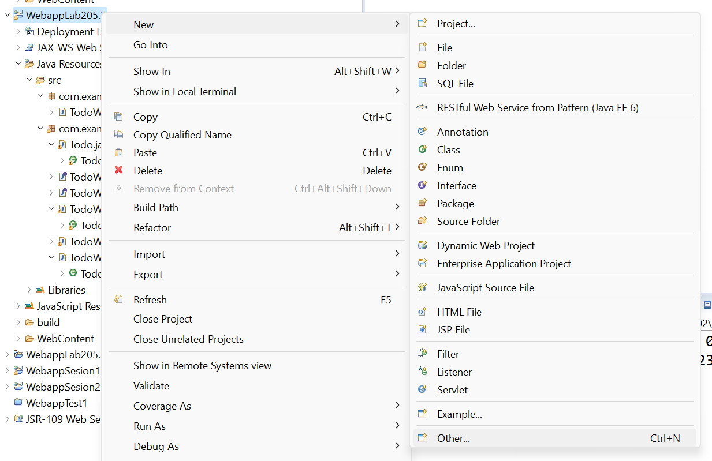
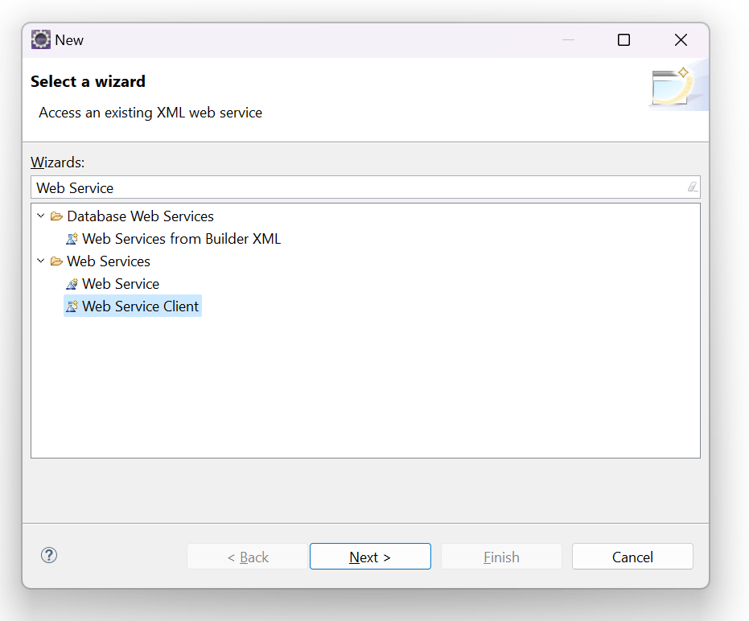
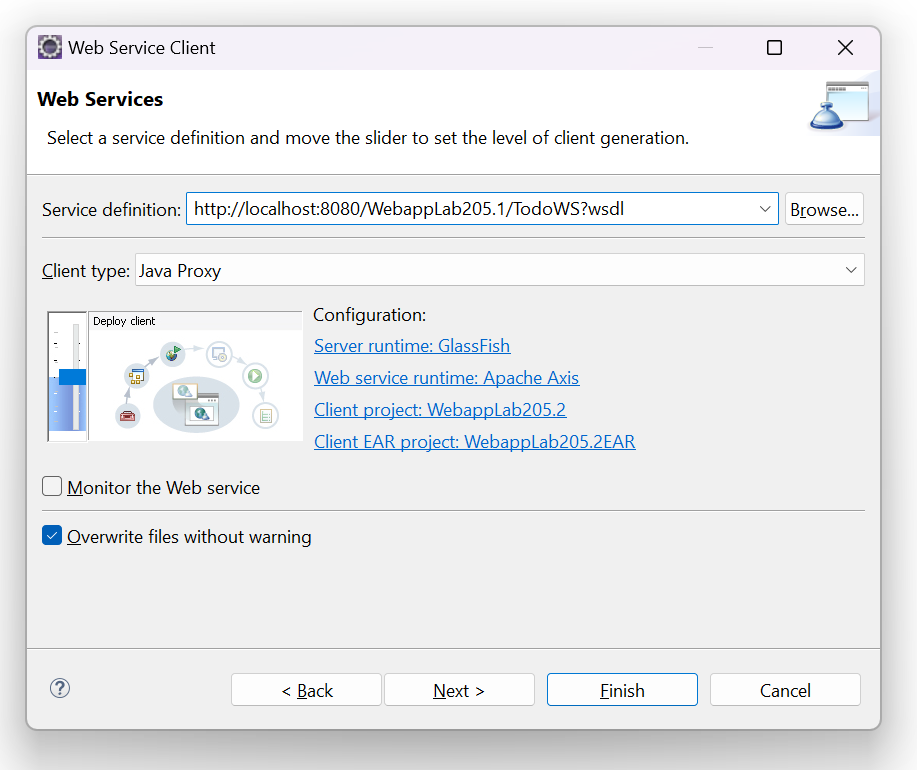
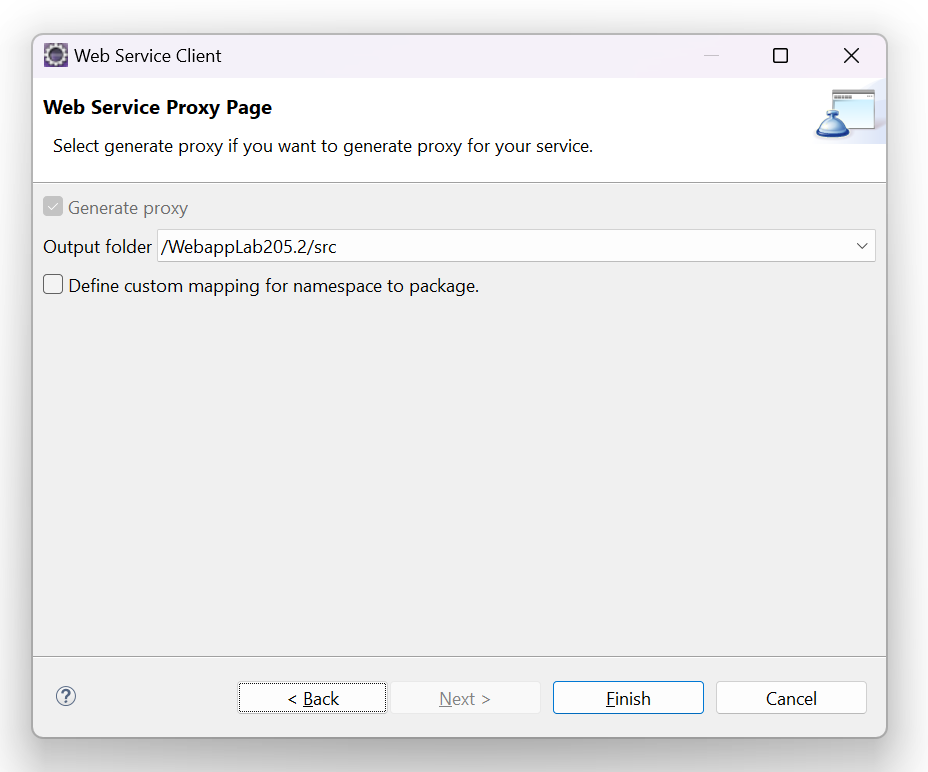
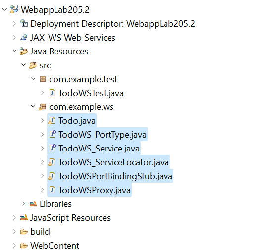
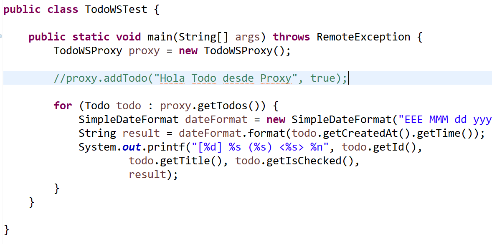

# M205 - Servicios web SOAP con JAX-WS

Por [Alan Badillo Salas](mailto:alan@nomadacode.com)

## Contenido

    Creación y prueba de un cliente y un servicio web SOAP
    Creación de un cliente de servicio web
    Anotación de los métodos del servicio web SOAP
    Creación de un cliente de servicio web

---

## Servicios RESTful con JAX-RS 

> **JAX-RS** - Ejemplo de la aplicación principal que activa a JAX-RS

```java
import javax.ws.rs.ApplicationPath;
import javax.ws.rs.core.Application;

// Esta clase está anotada para activar JAX-RS
// y habilitar todas las clases anotas con @Path
// La clase necesita derivar de Application
@ApplicationPath("/api")
public class ApplicationConfig extends Application {

}
```

> **JAX-RS** - Ejemplo de un servicio `UserService`

```java
import java.util.HashMap;
import java.util.Map;
import java.util.Set;

import javax.ws.rs.Consumes;
import javax.ws.rs.GET;
import javax.ws.rs.POST;
import javax.ws.rs.Path;
import javax.ws.rs.Produces;
import javax.ws.rs.core.MediaType;

@Path("/users")
public class UserService {

	private Map<Long, User> users = new HashMap<Long, User>();
	
	@POST
	@Consumes(MediaType.APPLICATION_XML)
	@Produces(MediaType.APPLICATION_XML)
	@Path("/new")
	public User createUser(User user) {
		users.put(user.getId(), user);
		return user;
	}
	
	@GET
	@Produces(MediaType.APPLICATION_XML)
	public User[] getUsers() {
		Set<Long> ids = users.keySet();
		User[] usersArray = new User[ids.size()];
		
		int i = 0;
		for (User user : users.values()) {
			usersArray[i++] = user;
		}
		
		return usersArray;
	}
	
}
```

---

> **Ejercicio 205.1** - Define un servicio *RESTful* de *JAX-RS* para agregar y recibir *Todos*

## Servicios Web SOAP con JAX-WS

> **JAX-WS** - Ejemplo de un servicio `CalculatorWS`

```java
package com.example.ws;
import javax.jws.WebMethod;
import javax.jws.WebParam;
import javax.jws.WebService;

@WebService(serviceName="CalculatorWS")
public class CalculatorWS {

	@WebMethod
	public int add(@WebParam(name = "a") int i, @WebParam(name = "b") int j) {
		return i + j;
	}
	
}
```

> **Ejercicio 205.2** - Define un servicio web *SOAP* de *JAX-WS* para agregar y recibir *Todos*

## Cliente de Servicios Web con JAX-WS

> Sobre el proyecto creamos un nuevo `Web Service Client`, por lo que seleccionamos `Other...` (`Ctrl+N`)



> Buscamos `Web Service Client`



> Insertamos la ruta a nuestro **JAX-WS** (`http://localhost:8080/MyProject/MyWS?wsdl`)





> Se generarán todos los archivos necesarios para consumir el **JAX-WS**



> Usamos el `MyWSProxy` para consumir nuestro servicio web `MyWS`



Ahora el cliente podrá acceder a los métodos definidos en el **JAX-WS** de forma remota y presentar los resultados en forma tradicional.

## Práctica 205 - Administrar *Todos* con JAX-WS

Genera un Servicio Web *SOAP* con *JAX-WS*, para administrar los *Todos* y sus operaciones básicas (al menos agregar y consultar todos).

Crea un cliente para línea de comandos que sea capaz de agregar o consultar los *Todos*.

Extiende al cliente para brindarle páginas JSP o JSF.

### Evaluación

> **Pregunta 1**
>
> ¿Qué contiene el código fuente generado para los modelos/entidades y qué interfaz implementan?

> **Pregunta 2**
>
> ¿Dónde se encuentran los métodos finales que se definieron como `@WebMethod` en el *SOAP* de *JAX-WS*?

> **Pregunta 3**
>
> ¿Cómo al llamar un método del proyecto del cliente, este se transporta al *JAX-WS* y se devuelven los resultados?