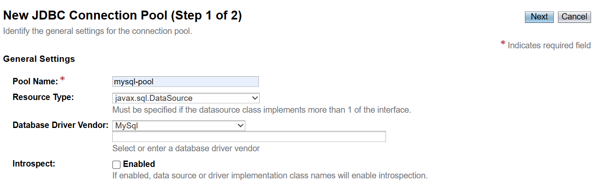
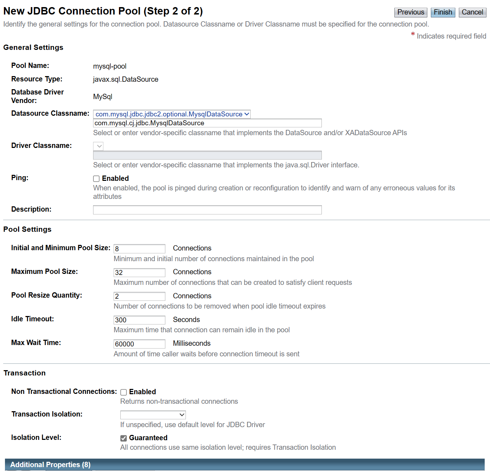
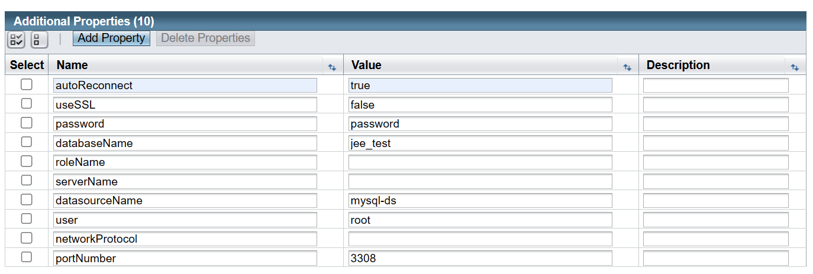
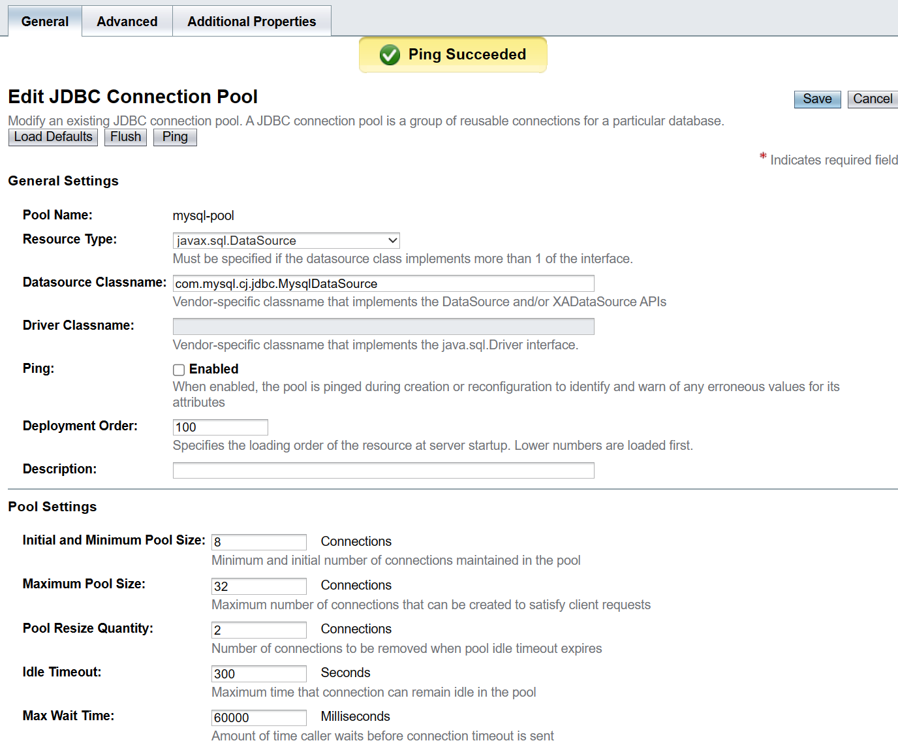
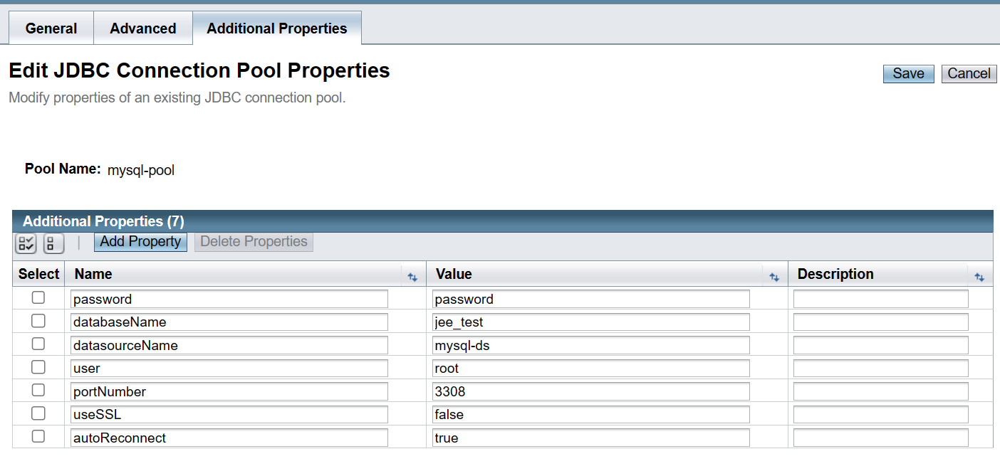
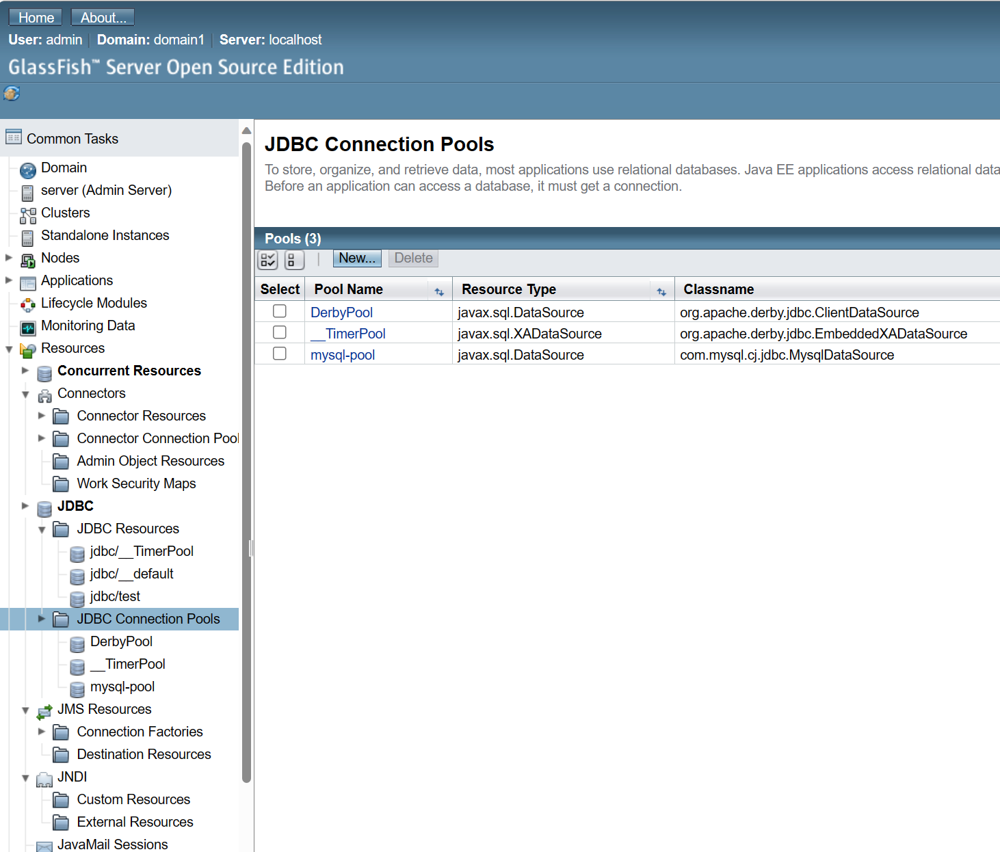
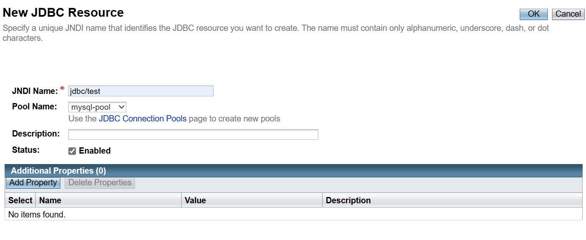
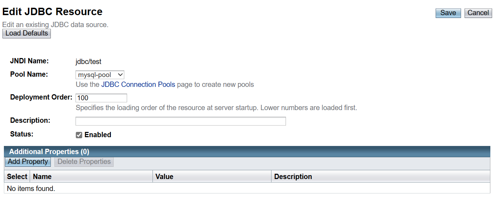
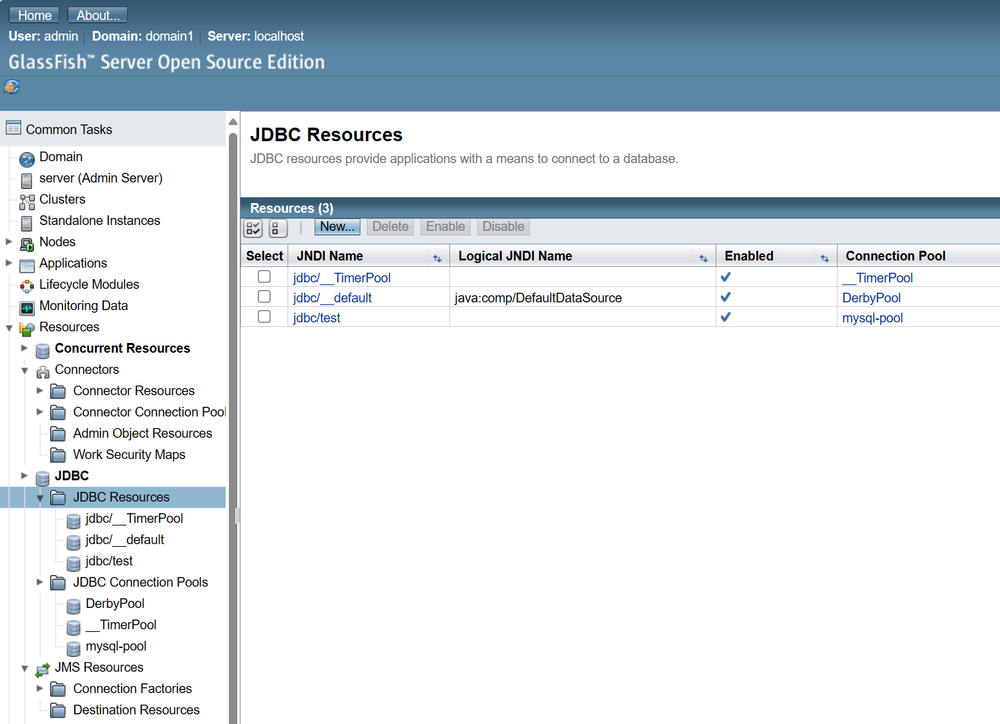

# M206 - JNDI Services

Por [Alan Badillo Salas](mailto:alan@nomadacode.com)

## Contenido

    - Configuración de una base de datos Java DB
    - Conexión a la base de datos sin JNDI
    - Conexión a la base de datos usando JNDI

---

## Configuración de una base de datos Java DB

```sql
create database jee_test;

use jee_test;

create table test(
	id int primary key auto_increment,
    title varchar(255) not null,
    created timestamp default now(),
    updated timestamp null
);

insert into test (title) values('Hola test 1');
insert into test (title) values('Hola test 2');

select * from test;

update test set updated=now() where id=1;

delete from test where id=2;

alter table test auto_increment=2;
```

---

> **Ejercicio 206.1** - Crea una base de datos llamada `jee_todos` y una tabla llamada `todos` con los campos asociados a un *Todo*

## Conexión a la base de datos sin JNDI

```java
package com.example.services;

import java.sql.Connection;
import java.sql.DriverManager;
import java.sql.PreparedStatement;
import java.sql.ResultSet;
import java.sql.SQLException;
import java.util.logging.Logger;

import javax.annotation.ManagedBean;
import javax.enterprise.context.ApplicationScoped;
import javax.naming.Context;
import javax.naming.InitialContext;
import javax.naming.NamingException;
import javax.sql.DataSource;

@ManagedBean
@ApplicationScoped
public class JDBCServiceLocal {

	Logger logger = Logger.getLogger(getClass().getName());
	
	DataSource dataSource;
	
	Connection connection;
	
	public JDBCServiceLocal() {
		logger.info("Inicializando JDBC (local)");
		try {
			Class.forName("com.mysql.cj.jdbc.Driver");
			connection = DriverManager.getConnection("jdbc:mysql://localhost:3308/jee_test?autoReconnect=true&useSSL=false", "root", "password");
			logger.info(connection == null ? "Sin conexión" : "Conectado");
			logger.info(connection.toString());
		} catch (ClassNotFoundException e) {
			logger.info("ClassNotFoundException: " + e.getMessage());
		} catch (SQLException e) {
			logger.info("SQLException: " + e.getMessage());
		}
	}
	
	public String test() throws SQLException {
		logger.info("Test JDBC (local)");
		
		PreparedStatement statement = connection.prepareStatement("select * from test");
		
		ResultSet resultSet = statement.executeQuery();
		
		String result = "";
		
		while(resultSet.next()) {
			String title = resultSet.getString("title");
			result += title + "\n";
		}
		
		return result;
	}
	
}
```

---

> **Ejercicio 206.2** - Crea el servicio para consumir los *Todos* con una conexión sin *JDNI*

## Conexión a la base de datos usando JNDI

> **Paso 1** - Creamos una nueva piscina de conexiones







> **Paso 2** - Verificamos que la conexión funcione







> **Paso 3** - Creamos un JDNI para la conexión a la psicina







> **Paso 4** - Consumimos la conexión mediante JDNI

```java
package com.example.services;

import java.sql.Connection;
import java.sql.PreparedStatement;
import java.sql.ResultSet;
import java.sql.SQLException;
import java.util.logging.Logger;

import javax.annotation.ManagedBean;
import javax.enterprise.context.ApplicationScoped;
import javax.naming.Context;
import javax.naming.InitialContext;
import javax.naming.NamingException;
import javax.sql.DataSource;

@ManagedBean
@ApplicationScoped
public class JDBCService {

	Logger logger = Logger.getLogger(getClass().getName());
	
	DataSource dataSource;
	
	Connection connection;
	
	public JDBCService() {
		logger.info("Inicializando JDBC");
		try {
			Context context = new InitialContext();
			dataSource = (DataSource) context.lookup("jdbc/test");
			logger.info(dataSource.toString());
			Class.forName("com.mysql.cj.jdbc.Driver");
			connection = dataSource.getConnection();
			logger.info(connection == null ? "Sin conexión" : "Conectado");
			logger.info(connection.toString());
		} catch (NamingException e) {
			logger.info("NamingException: " + e.getMessage());
		} catch (ClassNotFoundException e) {
			logger.info("ClassNotFoundException: " + e.getMessage());
		} catch (SQLException e) {
			logger.info("SQLException: " + e.getMessage());
		}
	}
	
	public String test() throws SQLException {
		logger.info("Test JDBC");
		
		PreparedStatement statement = connection.prepareStatement("select * from test");
		
		ResultSet resultSet = statement.executeQuery();
		
		String result = "";
		
		while(resultSet.next()) {
			String title = resultSet.getString("title");
			result += title + "\n";
		}
		
		return result;
	}
	
}
```

> **Paso 5** - Simplificamos la inyección JDNI por recursos

```java
package com.example.services;

import java.sql.Connection;
import java.sql.PreparedStatement;
import java.sql.ResultSet;
import java.sql.SQLException;
import java.util.logging.Logger;

import javax.annotation.ManagedBean;
import javax.annotation.Resource;
import javax.enterprise.context.ApplicationScoped;
import javax.sql.DataSource;

@ManagedBean
@ApplicationScoped
public class JDBCServicePro {

Logger logger = Logger.getLogger(getClass().getName());
	
	@Resource(lookup="jdbc/test")
	DataSource dataSource;
	
	public String test() throws SQLException {
		Connection connection = dataSource.getConnection();
		
		logger.info("Test JDBC (PRO)");
		
//		connection.setAutoCommit(false);
		
		PreparedStatement statement = connection.prepareStatement("select * from test");
		
		ResultSet resultSet = statement.executeQuery();
		
		String result = "(PRO)\n";
		
		while(resultSet.next()) {
			String title = resultSet.getString("title");
			result += title + "\n";
		}
		
		return result;
	}
	
}
```

---

> **Ejercicio 206.3** - Crea el servicio para consumir los *Todos* con una conexión usando *JDNI*