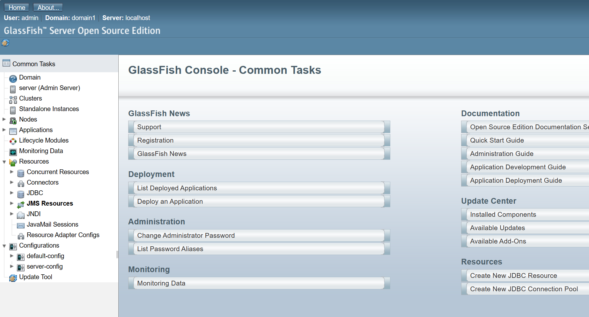
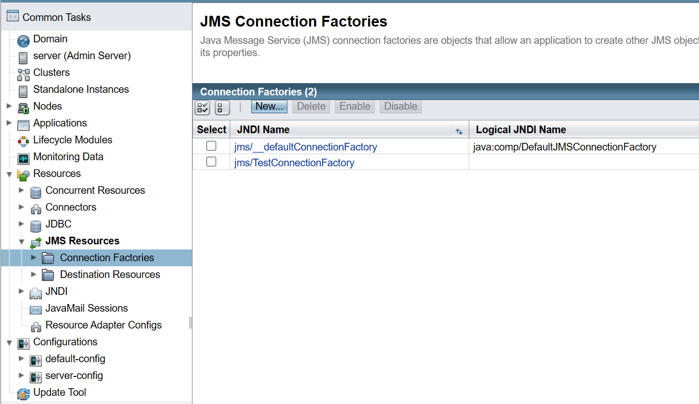
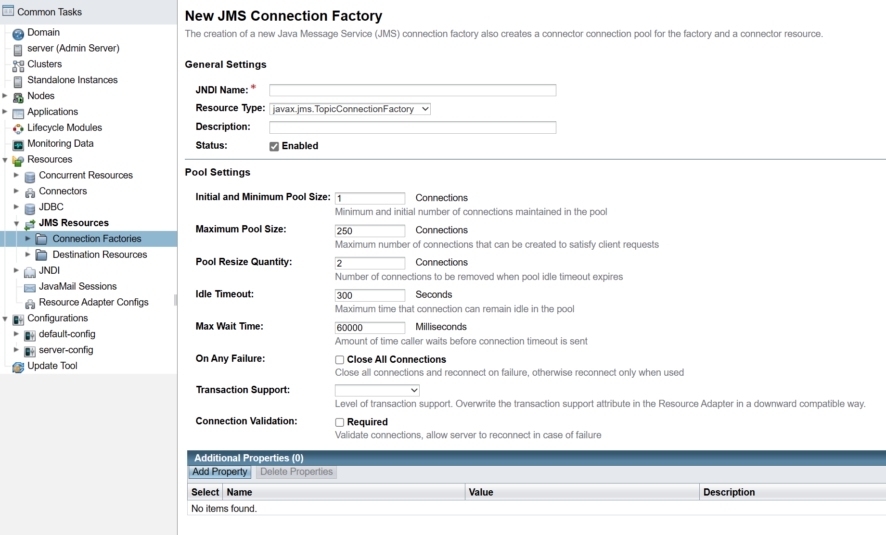
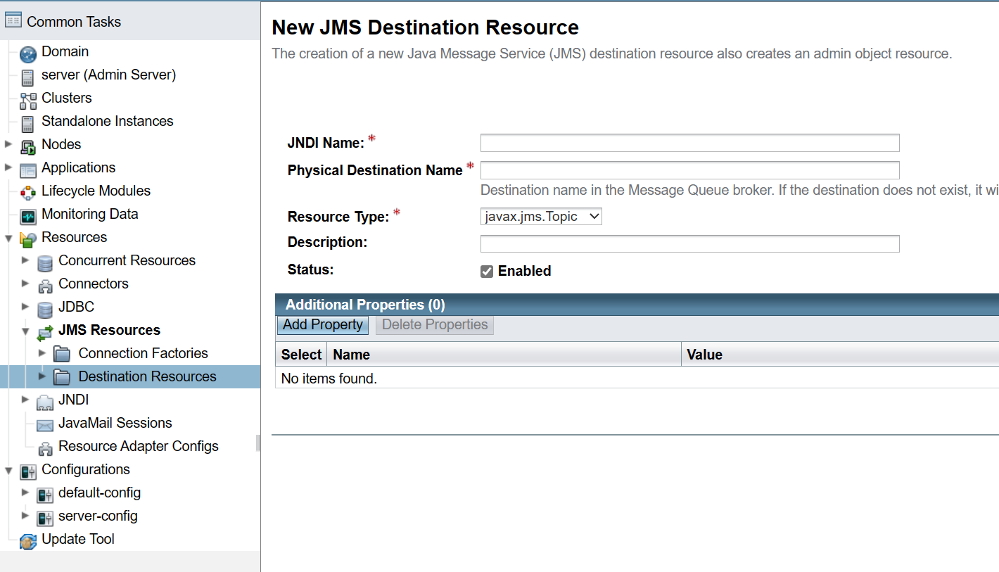

# JMS (Java Message Service)

Por [Alan Badillo Salas](mailto:alan@nomadacode.com)

## Contenido

    - Creación de una cola JMS mediante GlassFish
    - Creación de un productor y consumidor de colas JMS basado en web
    - Creación de un cliente Java SE asíncrono para una cola

---

El Servicio Mensajería de Java permite enviar mensajes (objetos) a través de los contenedores para diferentes proyectos, con la posibilidad de comunicar mensajes en dos formatos:

* **Encolado (Queue)** - Permite enviar una serie de mensajes que serán registrados en una cola, y recuperados sin pérdida.
* **Tópico (Topic)** - Permite enviar mensajes en forma instantánea, sin generar memoria en el tiempo (estilo Broker o notificaciones).

El servicio de JMS es un recurso que brinda el servidor (GlassFish), por lo que múltiples proyectos independientes pueden usarlo para comunicarse entre ellos, sin la necesidad de estar bajo los mismos proyectos o espacios de nombres.

El consumo de los mensajes que se están enviando en JMS se da a través de JNDI como recursos de un `FactoryConnection` y un tipo `Queue` o `Topic`, que puede ser producidor de mensajes (`Producer/Provider`) o un consumidor de los mensajes (`Consumer/Destination`).

> Muestra de cómo se integran el `ConnectionFactory`, el  `Queue/Topic` y el `Destination`


La forma de enviar los mensajes es recuperar de la conexión al recurso (al JNDI) el `Destination` de tipo `Queue` o `Topic` y enviar o recibir los mensajes desde él o hacia él.

> **Queue** Se considera un tipo de mensajería `punto-a-punto` (PTP - Point-To-Point)
>
> Es está diseñado para atender cliente punto-a-punto y encolar los mensajes mientras no sean consumidos por el cliente.


> **Topic** Se considera un tipo de mensajería `publicador/suscriptor` (*pub/sub* - `publish/subscribe`)
>
> En este tipo de mensajería nosotros creamos sucriptores que estén escuchando los mensajes que son publicados, y aquellos que no escuchen (mientras no haya suscripción) se perderán.
>
> Esto permite atender a múltiples consumidores.


## Configuración del recurso en GlassFish

> **Paso 1** - Ingresar a la consola administrativa de GlassFish
>
> Ingresa a [http://localhost:4848/](http://localhost:4848/) si no se cambió el puerto



> **Paso 2** - Definir un recurso de conexión de JMS (`ConnectionFactory`)
>
> `Resources > JMS Resources > Connection Factories * New...`




> **Paso 3** - Configuramos el JNDI para la conexión a JMS
>
> Podemos usar `javax.jms.ConnectionFactory`, `javax.jms.QueueConnectionFactory` o `javax.jms.TopicConnectionFactory`
>
> **Nota:** Es importante siempre cargar los nombres de JNDI para saber qué tipo de recurso esperamos.



> **Paso 4** - Configuramos el JNDI para el `Destination` de tipo `Queue` o `Topic` que usaremos como destino (`punto-a-punto` o `pub/sub`).
>
> El nombre físico es requerido para ser distinto de los demás objetos (este es un objeto vivo que estará del lado del servidor).
>
> El tipo puede ser `javax.jms.Queue` o `javax.jms.Topic`



## Crear un Producer (proveedor/producidor) de mensajes

> **Paso 1** - Importamos los recursos de JNDI para el `ConnectionFactory` (la conexión a JMS) y el `Destination` (`Queue` o `Topic`)

```java
// La conexión a JMS
@Resource(lookup = "jms/MyConnectionFactory")
ConnectionFactory connectionFactory;

// El destinatario de JMS (Destination)
@Resource(lookup ="jms/MyQueue")
Queue queue; 

// El destinatario de JMS (Destination)
@Resource(lookup ="jms/MyTopic")
Topic topic; 
```

> **Paso 2** - Crear un contexto para crear dentro el `Producer` y enviar los mensajes al `Destination`

```java
try ( JMSContext context = connectionFactory.createContext(); ) {
    // ... Creamos el Producer
    // ... Recuperamos el Destination
    // ... Enviamos los mensajes
} catch (Exception e) {
    // ... Controlamos la excepción
}
```

> **Paso 3** - Crear el `Producer`, recuperar el `Destination` y enviar los mensajes.

```java
// ... Creamos el Producer
JMSProducer producer = context.createProducer();
// ... Recuperamos el Destination
Destination destination = (Destination) queue; // (Destination) topic
// ... Enviamos los mensajes
producer.send(destination, message)
```

> **Ejemplo de un Producer**

```java
import javax.jms.ConnectionFactory

@Stateless
public class MyBeanProducer {

    // La conexión a JMS
    @Resource(lookup = "jms/DemoConnectionFactory")
    ConnectionFactory connectionFactory;

    // El destinatario de JMS (Destination)
    @Resource(lookup ="jms/DemoQueue")
    Queue queue; 
    // -> Destination destination = (Destination) queue;

    public void sendMessage() {

        try ( JMSContext context = connectionFactory.createContext(); ) {

            JMSProducer producer = context.createProducer();

            Destination destination = (Destination) queue;

            producer.send(destination, "Hola mundo");

        } catch (Exception e) {
            e.printStackTrace();
        }

    }

}
```

## Crear un Consumer (consumidor) de mensajes tipo `Queue`

> **Paso 1** - Importamos los recursos de JNDI para el `ConnectionFactory` (la conexión a JMS) y el `Destination` (`Queue` o `Topic`)

```java
// La conexión a JMS
@Resource(lookup = "jms/MyConnectionFactory")
ConnectionFactory connectionFactory;

// El destinatario de JMS (Destination)
@Resource(lookup ="jms/MyQueue")
Queue queue;
```

> **Paso 2** - Crear un contexto para crear dentro el `Consumer` y recibir los mensajes

```java
try ( JMSContext context = connectionFactory.createContext(); ) {
    // ... Recuperamos el Destination
    // ... Creamos el Consumer
    // ... Recibimos los mensajes
} catch (Exception e) {
    // ... Controlamos la excepción
}
```

> **Paso 3** - Crear el `Producer`, recuperar el `Destination` y enviar los mensajes.

```java
// ... Recuperamos el Destination
Destination destination = (Destination) queue;
// ... Creamos el Consumer
JMSConsumer consumer = context.createConsumer(destination);
// ... Recibimos los mensajes
Message message = consumer.receive(); // Bloqueado hasta que llegue

Message message = consumer.receive(10_000); // Con máximo de tiempo de espera (10s / 10,000ms)

MyObject messageObject = message.getBody(MyObject.class);

logger.info(messageObject);
```

> **Ejemplo de un Consumer**

```java
import javax.jms.ConnectionFactory

@Stateless
public class MyBeanConsumer {

    // La conexión a JMS
    @Resource(lookup = "jms/DemoConnectionFactory")
    ConnectionFactory connectionFactory;

    // El destinatario de JMS (Destination)
    @Resource(lookup ="jms/DemoQueue")
    Queue queue; 
    // -> Destination destination = (Destination) queue;

    public String getLastMessage() {

        try ( JMSContext context = connectionFactory.createContext(); ) {

            Destination destination = (Destination) queue;
            
            JMSConsumer consumer = context.createConsumer(destination);
            
            Message message = consumer.receive(1); // ms

            String messageText = message.getBody(String.class);

            return messageText;

        } catch (Exception e) {
            e.printStackTrace();
        }

        return null;
    }

}
```